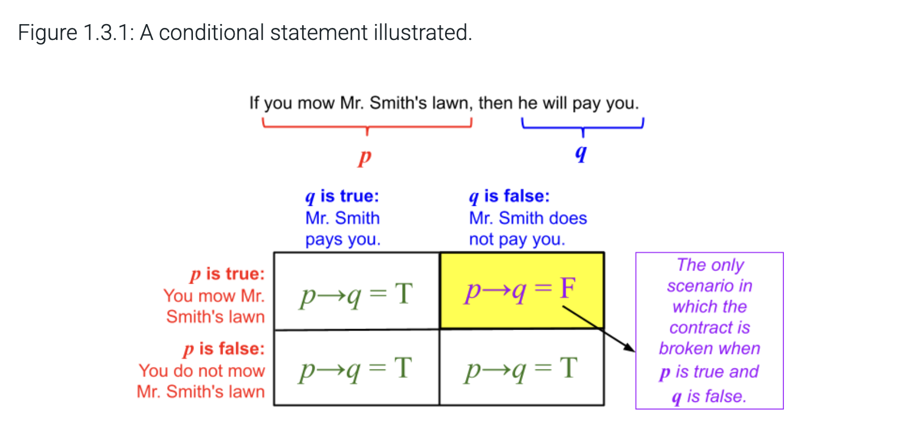
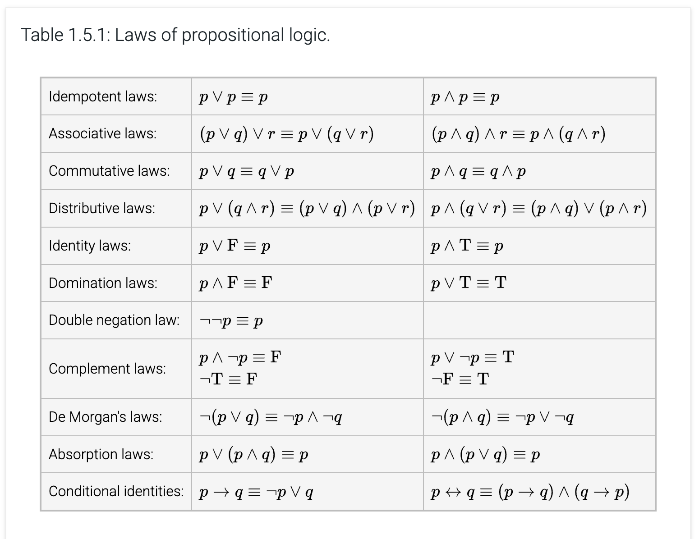
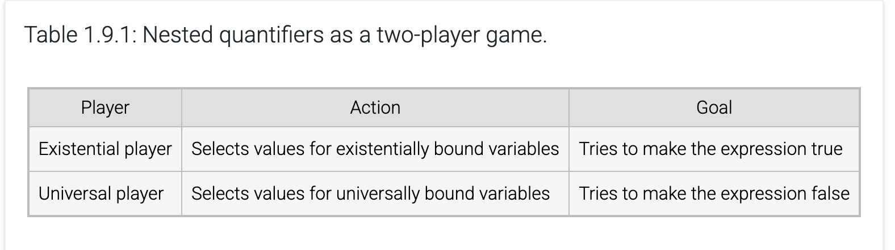
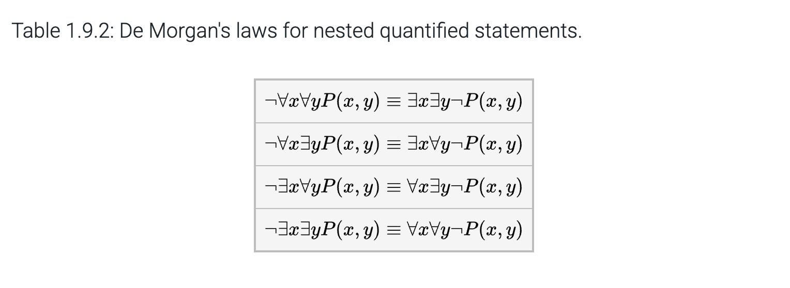
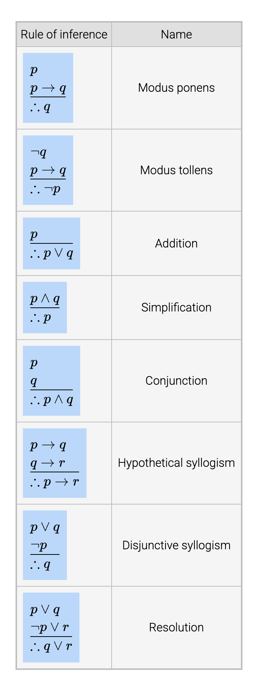
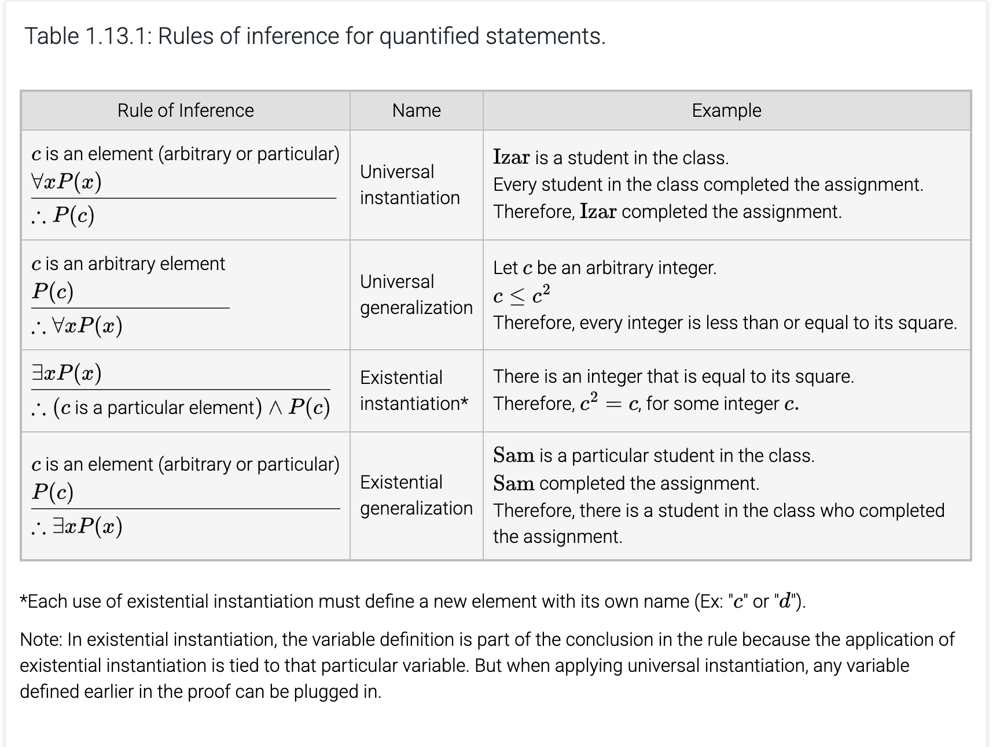

# Chapter 1: Logic

## Table of Contents

- [Chapter 1: Logic](#chapter-1-logic)
  - [Table of Contents](#table-of-contents)
    - [1.1 Propositions and Logical Operations](#11-propositions-and-logical-operations)
      - [Compound Propositions](#compound-propositions)
    - [1.2 Evaluating Compound Propositions](#12-evaluating-compound-propositions)
      - [Example](#example)
    - [1.3 Conditional Statements](#13-conditional-statements)
      - [Important Terms](#important-terms)
      - [The Biconditional Operation](#the-biconditional-operation)
    - [1.4 Logical Equivalence](#14-logical-equivalence)
      - [De Morgan's Laws](#de-morgans-laws)
    - [1.5 Laws of Propositional Logic](#15-laws-of-propositional-logic)
    - [1.6 Predicates and Quantifiers](#16-predicates-and-quantifiers)
    - [1.7 Quantified Statements](#17-quantified-statements)
    - [1.8 De Morgan's law for quantified statements](#18-de-morgans-law-for-quantified-statements)
    - [1.9 Nested Quantifiers](#19-nested-quantifiers)
    - [1.10: More Nested Quantified Statements](#110-more-nested-quantified-statements)
      - [Using logic to express 'everyone else'](#using-logic-to-express-everyone-else)
      - [Expressing uniqueness](#expressing-uniqueness)
      - [Moving quantifiers in logical statements](#moving-quantifiers-in-logical-statements)
    - [1.11: Logical Reasoning](#111-logical-reasoning)
    - [1.12: Rules of inference with propositions](#112-rules-of-inference-with-propositions)
    - [1.13 Rules of Inference with Quantifiers](#113-rules-of-inference-with-quantifiers)

---

### 1.1 Propositions and Logical Operations

- Logic is a set of rules in which we can analyze something. Formally, it is the study of formal reasoning.
- A proposition is a *statement* that is *either true or false*. It is the most basic element of logic.
- *All humans have two eyes.*: an example of a false proposition (exceptions exist)
- All questions, commands, requests, and exclamations are NOT propositions.
- Even if you don't know the exact truth value, the proposition is still a proposition.
  - e.g.: *Monday will be cloudy.* (unknown)
  - e.g.: *The movie was funny.* (matter of opinion)
- We denote propositions with variables, e.g., $p$, $q$, or $r$ to make it simpler to represent.
- A **truth table** shows the truth value of all the possible combinations of the variables. Every row is a single combination. The total number of combinations is $2^n$, where $n$ is the number of variables.

#### Compound Propositions

1. **Conjunction**
   - *logical operation*: $\land$
   - *example*: $p \land q$ read as "$p$ and $q$"
   - *explanation*: Only true when all operands are true.
2. **Disjunction (Inclusive Or)**
   - *logical operation*: $\lor$
   - *example*: $p \lor q$ read as "$p$ or $q$"
   - *explanation*: Only false when all operands are false.
3. **Exclusive Or (XOR)**
   - *logical operation*: $\oplus$
   - *example*: $p \oplus q$ read as either "$p$ or $q$"
   - *explanation*: Only true when an odd number of operands is true.
4. **Negation**
   - *logical operation*: $\neg$
   - *example*: $\neg\:p$ read as "not $p$"
   - *explanation*: Flips the truth value of the variable after it.

---

### 1.2 Evaluating Compound Propositions

- Order of operations: NAO (not, and, then or)
- This section is mostly calculations, and could be easily checked for outside sources. Below, there is an easy example. If I find harder examples in the future, I will hopefully include them.

#### Example

Evaluate $(p \land q) \lor (\neg p \land r)$, where:

- $p = \text{True}$
- $q = \text{False}$
- $r = \text{True}$

Steps:

1. $p \land q = \text{False}$ (since $q = \text{False}$)
2. $\neg p = \text{False}$ (since $p = \text{True}$)
3. $\neg p \land r = \text{False}$
4. $\text{False} \lor \text{False} = \text{False}$

Result:
$(p \land q) \lor (\neg p \land r) = \text{False}$

### 1.3 Conditional Statements

- The **conditional operation** is written as $\rightarrow$.
- $p \rightarrow q$ is read "if $p$, then $q$"
- It is only false if $p$ is true and $q$ is false.
- A compound proposition that uses a conditional operation is a **conditional proposition**
- $p$ is the **hypothesis** and $q$ is the **conclusion**.
- Truth Table:

|    $p$    |    $q$    | $p \rightarrow q$ |
| :----------: | :----------: | :-----------------: |
| $\text{T}$ | $\text{T}$ |    $\text{T}$    |
| $\text{T}$ | $\text{F}$ |    $\text{F}$    |
| $\text{F}$ | $\text{T}$ |    $\text{T}$    |
| $\text{F}$ | $\text{F}$ |    $\text{T}$    |

- A tricky thing might be is that conditional statements are ALWAYS true when the hypothesis is false.

- A tricky thing might be is that conditional statements are ALWAYS true when the hypothesis is false.

- The following are different ways to express conditional operations:
  - If $p$, then $q$.
  - If $p$, $q$
  - $q$ if $p$
  - $p$ implies $q$
  - $q$ whenever $p$
  - $p$ only if $q$ (if conclusion is false, the hypothesis cannot be true, otherwise the conditional statement would be false)
  - $p$ is sufficient for $q$
  - $q$ is necessary for $p$

#### Important Terms

- **Converse**: Just flip it.
- **Contrapositive**: Flip and Negate
- **Inverse**: Just negate it.

#### The Biconditional Operation

- $p \leftrightarrow q$ is read as $p$ if only and only if $q$
- Truth Table:

|    $p$    |    $q$    | $p \leftrightarrow q$ |
| :----------: | :----------: | :---------------------: |
| $\text{T}$ | $\text{T}$ |      $\text{T}$      |
| $\text{T}$ | $\text{F}$ |      $\text{F}$      |
| $\text{F}$ | $\text{T}$ |      $\text{F}$      |
| $\text{F}$ | $\text{F}$ |      $\text{T}$      |

- It is only true when both the hypothesis and conclusion have the same values.
- $p$ is necessary and sufficient for $q$
- **iff**

### 1.4 Logical Equivalence

- **Tautology**: when a compound proposition is always true, regardless of the truth value of the propositions within.
- **Contradiction**: when a compound proposition is always false, regardless of the truth value of the propositions within.
- Simply, one example is enough to counter the claim that a proposition is a tautology or a contradiction, hence it is referred to as the *counterexample*.
- Two compound propositions are **logically equivalent** if they have the same truth value regardless of the truth value of their propositions within. (denoted as $\equiv$)

#### De Morgan's Laws

- logical equivalences showing how to correctly distribute negation operations on a parenthesized expression.

1. $\neg (p \lor q) \ \ \equiv\ \  (\neg p \land \neg q)$
2. $\neg (p \land q) \ \ \equiv\ \  (\neg p \lor \neg q)$

### 1.5 Laws of Propositional Logic

The following table contains all the major laws. Be sure to know them

### 1.6 Predicates and Quantifiers

- **Predicate**: a logical statement with a truth value that is a function of one or more variables

Examples:

$$
\begin{equation}
    Q(x, y): x^{2} = y
  \end{equation}
  \\
  \begin{equation}
    R(x, y, z): x + y = z
  \end{equation}
$$

- When we substitute the variables with values, the predicate becomes a proposition.
- The **domain** of a variable in a predicate is the set of all possible values for the variable.
- Even if it has a truth value, as long as it contains a variable, it is still a predicate.
- Another way to change a predicate into a proposition is to use quantifiers.
- $\forall$ is a **universal quantifier**, and $\forall xP(x)$ is a **universally quantified statement**.

$$
\forall xP(x) = P(a_{1}) \land P(a_{2}) \land \ldots \land P(a_k)
$$

- A **counterexample** for a universally quantified statement is an element in the domain for which the predicate is false.
- A $\exists$ is an **existential quantifier**, and $\exists xP(x)$ is an **existentially quantified statement**.
- *Both the exists and the forall are propositions.*

$$
\exists xP(x) = P(a_{1}) \lor P(a_{2}) \lor \ldots \lor P(a_k)
$$

- An **example** for an existentially quantified statement is an element in the domain for which the predicate is true.
- If the domain is empty, the exists is false and the forall is true.

### 1.7 Quantified Statements

- Universally and existentially quantified statements could consist logical operations.
- $\exists x(P(x) \land O(x))$ -> There exists an $x$ where $P(x)$ and $O(x)$ are both true.
- Be aware of the parenthesis' placement after the quantifiers.
- $P(x)$ -> **free variable** bcz variable can take any value in the domain
- $\forall P(x)$ -> **bound variable** bcz variable is bound to quantifier
- A statement with no free variables is a proposition since we can determine its truth value.

### 1.8 De Morgan's law for quantified statements

$$
Domain = {a_1, a_2, \ldots, a_n} \\
\neg \forall P(x) \equiv \exists x \neg P(x) \\
\neg (P(a_1) \land P(a_2) \land \ldots \land P(a_n)) = \neg P(a_1) \lor \neg P(a_2) \lor \ldots \lor \neg P(a_n)
$$

- For both quantified statements, you enter the negation inside and switch the quantifier symbol.

### 1.9 Nested Quantifiers

- If the predicate has more than one variable, each variable must be bound in order for it to be a proposition.
- A logical expression with more than one quantifier that binds different variables in the same predicate has **nested quantifiers**.
- Nesting could be of the same type ($\forall \forall$, $\exists \exists$) or could be alternating ($\forall \exists$, $\exists \forall$)

### 1.10: More Nested Quantified Statements

#### Using logic to express 'everyone else'

#### Expressing uniqueness

$\exists x (L(x) \land \forall y ((x \mathrel{\char`≠} y) \to \neg L(y)))$

#### Moving quantifiers in logical statements

You can move a quantifier to the beginning as long as it does not pass another quantifier.

For example, $\forall x (A(x) \rightarrow \exists y M(x, y))$ is logically equivalent to $\forall x \exists y (A(x) \rightarrow M(x, y))$

### 1.11: Logical Reasoning

An **argument** is a sequence of propositions, called **hypotheses**, followed by a final proposition, called **conclusion**.

A **valid** argument is one where conclusion is true for every truth assignment to variables that cause the hypotheses to be true, otherwise it is **invalid**.

$$
h_1 \\
h_2 \\
\ldots \\
h_{n} \\
\therefore c
$$

This is valid whenever $( h_{1} \land h_{2} \land \ldots \land h_{n} )  \rightarrow c$ is a tautology.

To use a truth table to establish the validity of an argument, a truth table is constructed for all the hypotheses and the conclusion. Each row in which all the hypotheses are true is examined.
If the conclusion is true in each of the examined rows, then the argument is valid.
If there is any row in which all the hypotheses are true but the conclusion is false, then the argument is invalid.

*If the propositions are all never true, then the argument is valid.*

We can change English arguments into an argument **form** to prove validity of an argument.

### 1.12: Rules of inference with propositions

The validity of an argument could be established by applying the rules of inference and laws of propositional logic in a **logical proof**.
If proposition is a hypothesis, the justification is 'Hypothesis'.
The proposition in the last step should be conclusion.

The only way to master these questions is to practice more. There is no shortcut or tricks.

### 1.13 Rules of Inference with Quantifiers

To apply the inference rules to quantified expressions, the quantifier must be removed by plugging in a value from the domain to replace the variable.

A value that can be plugged in for the variable is an **element**. It can also be introduced with a generic name in a proof.

There are two types of named elements in logical proofs:

- **arbitrary**: No special properties other those shared among all
- **particular**: may have properties that are not shared by all elements

Every domain element introduced must be defined on a separate line of proof.
If element is defined in hypothesis, it is always a particular and definition is labeled 'Hypothesis'.
If introduced for first time in proof, the definition is labeled 'Element definition' and must specify whether arbitrary or particular.

**Existential Instantiation** and **Universal Instantiation** replace a quantified variable with an element of the domain.

**Existential Generalization** and **Universal Generalization** replace an element of the domain with a quantified variable.

Be aware of mistakes in proofs.
You should not assume that two variables introduced in the proof are the same unless there is a valid reason.

To show that an argument is invalid, we need a value where the hypotheses are true but conclusion is false.
