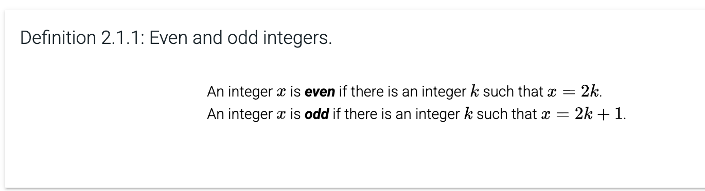
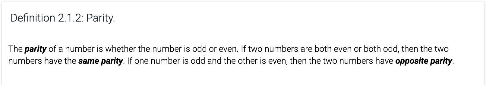
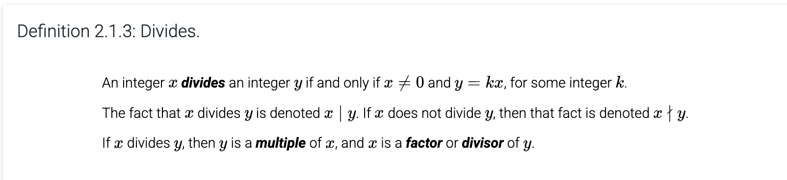
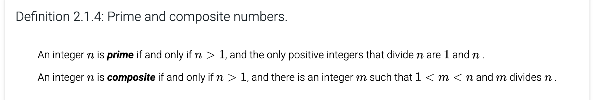
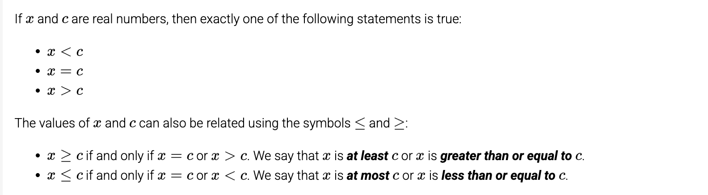
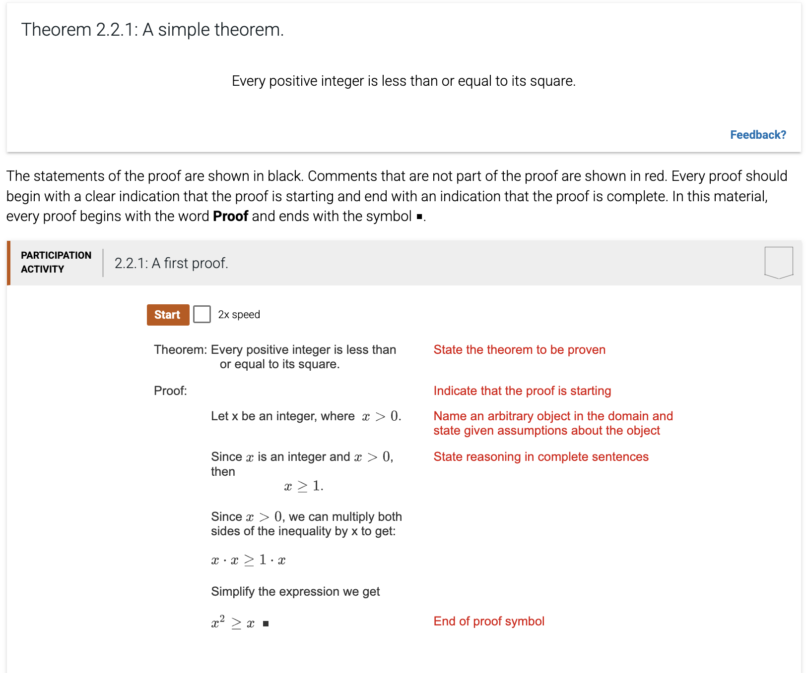
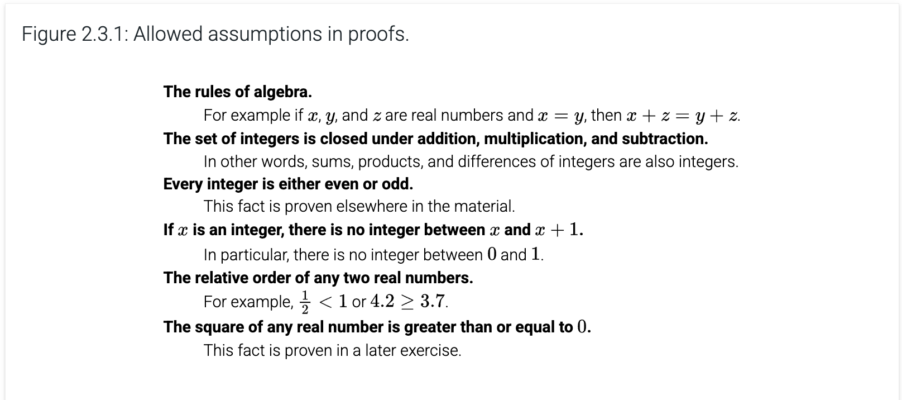
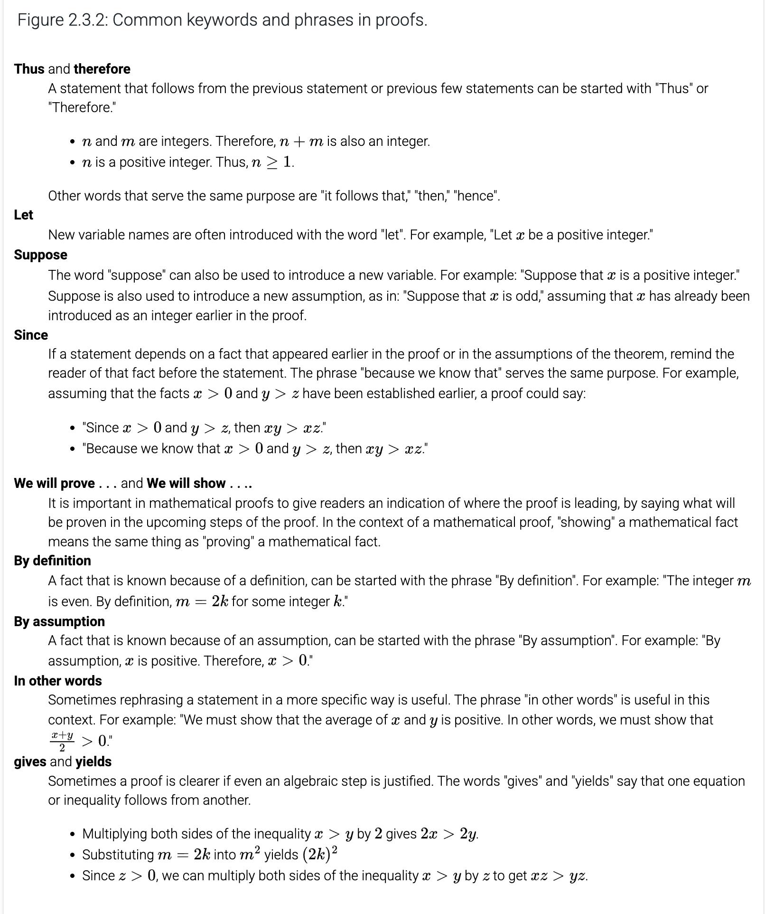
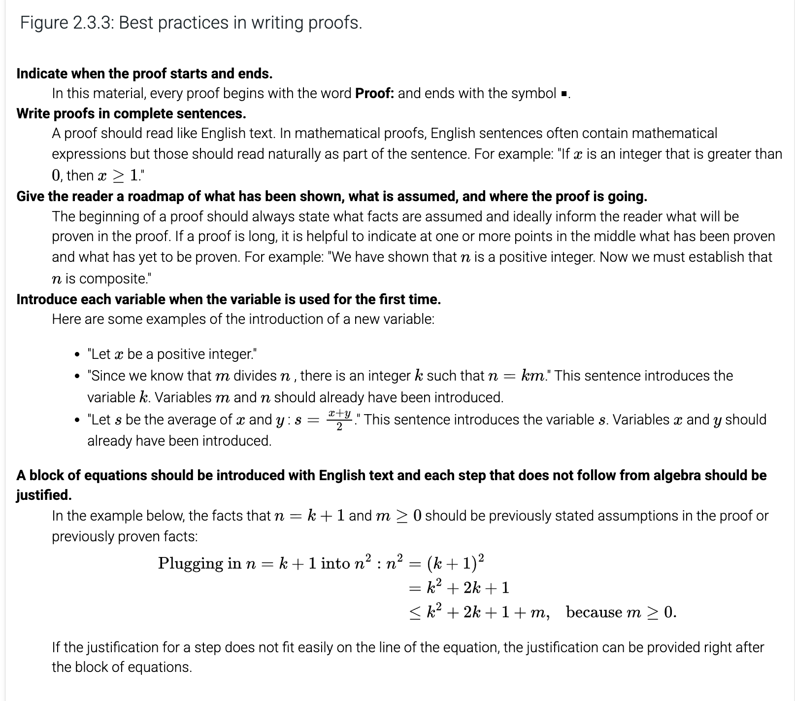

# Chapter 2: Proofs

## Table Of Contents

- [Chapter 2: Proofs](#chapter-2-proofs)
  - [Table Of Contents](#table-of-contents)
  - [2.1 Mathematical Definitions](#21-mathematical-definitions)
    - [Even and odd integers](#even-and-odd-integers)
    - [Rational Numbers](#rational-numbers)
    - [Divides](#divides)
    - [Prime and Composite Numbers](#prime-and-composite-numbers)
    - [Inequalities](#inequalities)
  - [2.2 Introduction to Proofs](#22-introduction-to-proofs)
    - [Theorems that are universal or existential statements](#theorems-that-are-universal-or-existential-statements)
    - [Proofs of universal statements](#proofs-of-universal-statements)
      - [Proofs by exhaustion](#proofs-by-exhaustion)
      - [Proofs by universal generalization](#proofs-by-universal-generalization)
    - [Proofs of existential statements](#proofs-of-existential-statements)
      - [Constructive proof](#constructive-proof)
      - [Nonconstructive Proof](#nonconstructive-proof)
      - [Disproving existential statements](#disproving-existential-statements)
  - [2.3 Best Practices and Common Errors in Proofs](#23-best-practices-and-common-errors-in-proofs)
    - [Allowed Assumptions](#allowed-assumptions)
    - [Common Keywords](#common-keywords)
    - [Best Practices](#best-practices)
    - [Common Mistakes](#common-mistakes)
  - [2.4 Writing Direct Proofs](#24-writing-direct-proofs)
  - [2.5 Proof by contrapositive](#25-proof-by-contrapositive)
  - [2.6 Proof by contradiction](#26-proof-by-contradiction)
  - [2.7 Proof by Cases](#27-proof-by-cases)
    - [Without loss of generality](#without-loss-of-generality)

---

## 2.1 Mathematical Definitions

Theorems and proofs establish facts about various mathematical objects such as graphs, functions, sequences, and sums.

### Even and odd integers

### Rational Numbers

A number $r$ is **rational** if there exist integers $x$ and $y$ such that $y$ ≠ 0 and $r = \frac{x}{y}$.

### Divides

### Prime and Composite Numbers

### Inequalities

">" implies >=
"<" implies <=

**positive** means greater than 0
**negative** means less than 0
**nonnegative** means at least 0
**nonpositive** means at most 0

---

## 2.2 Introduction to Proofs

A primary goal in math is prove theorems.
**Theorems** are statements that can be proven to be true. 
A **proof** consists of a series of steps that follow logically from assumptions or from previously proven statements, with a final step that results in the statement of the theorem being proven.
The proof may use **axioms**, which are statements assumed to be true, or previously proven theorems.

### Theorems that are universal or existential statements

Most theorems are assertions about all the elements in a set and are therefore universal statements.

> The sum of two positive real numbers is strictly greater than the average of the two numbers.
> If x and y are positive real numbers and n is a positive integer, then $(x+y)^n \ge x^n + y^n$

Some are existential ones.

> There is an integer that is equal to its square.

### Proofs of universal statements

#### Proofs by exhaustion

If domain is small, then checking each element might by the easiest way to prove.

#### Proofs by universal generalization

Most common if domain is very large to prove by exhaustion. Basically, you prove the theorem for an arbitrary element. Arbitrary means nothing else is assumed besides the original assumptions in the theorem statement.

**Definition**: consecutive integers are when one of them is equal to 1 plus the other.

A **counterexample** is an assignment of values to variables that shows that a universal statement is false.

### Proofs of existential statements

#### Constructive proof

Gives a specific example of an element in the domain to construct an
element that satisfies the theorem.

#### Nonconstructive Proof

Proves that an element with the required properties exists without giving a specific example. (Non-existence leads to contradiction)

#### Disproving existential statements

Analogous to proving universal statements.

## 2.3 Best Practices and Common Errors in Proofs

### Allowed Assumptions

### Common Keywords

### Best Practices

**Existential Instantiation**: a rule of logic that says if an object is known to exist, then it can be given a name, as long as the name is not currently in use.

### Common Mistakes

1. Generalizing from examples
2. Skipping steps
3. Circular reasoning
4. Assuming facts that have not yet been proven

## 2.4 Writing Direct Proofs

The hypothesis is assumed to be true and the conclusion is proven as a result

Typically, the first few sentences of a direct proof names one or more generic objects, states all assumptions about it, and then states what will be proven.

## 2.5 Proof by contrapositive

The conclusion is assumed false and the hypotheses are proven to be false.

## 2.6 Proof by contradiction

Assumes theorem is false and then shows that some logical inconsistency arises as a result.
Sometimes called **indirect proof**.

Often starts with "Suppose that the theorem is not correct"

The contrapositive is a special case of the contradiction.

## 2.7 Proof by Cases

Breaking domain into different classes and giving a different proof for every class, aka **case**.

### Without loss of generality

Sometimes the proofs for two different cases are so similar that including both cases is repetitive.
When this happens, the two cases can be merged into one case.

