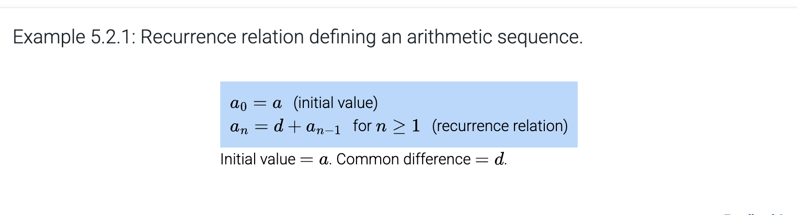
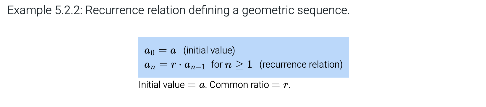
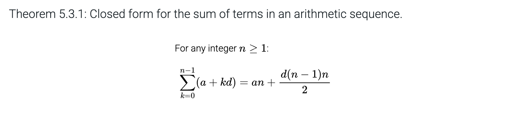

# Chapter 5: Sequences and Summations

## Table of Contents

- [Chapter 5: Sequences and Summations](#chapter-5-sequences-and-summations)
  - [Table of Contents](#table-of-contents)
  - [5.1 Sequences](#51-sequences)
    - [Increasing and decreasing](#increasing-and-decreasing)
    - [Geometric Sequences](#geometric-sequences)
    - [Arithmetic Sequences](#arithmetic-sequences)
  - [5.2 Recurrence Relations](#52-recurrence-relations)
  - [5.3 Summations](#53-summations)
    - [Vocab](#vocab)
    - [Notes](#notes)

## 5.1 Sequences

**sequence**: special function in which domain is a set of consecutive integers

In a sequence, subscripts denote input (aka domain) like $g_k$. A value is called a **term**, and k is **index** of $g_k$.

If function name and indices are understood or not important, you can just list the numbers.

The entire sequence is denoted by $\{g_k\}$.

The first index is usually 0 or 1 but could be any other alternative as well.

**Finite Sequence**: sequence with a finite domain. It has an **initial index** $m$ and a **final index** $n$, where $n \ge m$. Then, $a_m$ is **initial term** and $a_n$ is **final term**.

**Infinite Sequence**: sequence with an infinite domain. Indices go to positive infinity. There is an initial index $m$, and the sequence is defined for all indices $k$ such that $k \ge m$.

A sequence can be specified by an **explicit formula** showing how the value of $a_k$ depends on $k$. For example, $\{d_k\} = 2, 4, 8, 16, \ldots$ can be represented as $d_k = 2^k, \text{for} \ k \ge 1$

### Increasing and decreasing

**Increasing**: For every 2 consecutive indices $k$ and $k + 1$, in the domain, $a_{k} < a_{k+1}$.

**Nondecreasing**: For every 2 consecutive indices $k$ and $k + 1$, in the domain, $a_{k} \le a_{k+1}$.

**An increasing is always nondecreasing.**

**Decreasing**: For every 2 consecutive indices $k$ and $k + 1$, in the domain, $a_{k} > a_{k+1}$.

**Nonincreasing**: For every 2 consecutive indices $k$ and $k + 1$, in the domain, $a_{k} \ge a_{k+1}$.

**A decreasing is always nonincreasing.**

### Geometric Sequences

- a sequence of real numbers where each term after the initial is found by multiplying the previous with a **common ratio**.
- It can be finite or infinite.
- If the starting index is 0, then the explicit formula is $s_{k} = a \cdot r^{k}$, for $k \ge 0$.

### Arithmetic Sequences

- a sequence of real numbers where each term after the initial is found by adding a **common difference** on the previous term.
- It can be finite or infinite.
- If the starting index is 0, then the explicit formula is $t_{n} = t_{0} + dn$, for $n \ge 0$.

## 5.2 Recurrence Relations

A rule that defines a term as a function of the previous terms in the sequence.

Fibonacci sequence is also an example of this.

A **dynamical system** is a system that changes over time.
The state is determined by well-defined rules that depend on the past states of the system.
In **discrete time dynamical systems**, the time is divided into discrete time intervals, and the state of the system stays fixed within each interval.

## 5.3 Summations

### Vocab

1. Summation Notation $\displaystyle \sum_{j=s}^t$
2. Index of summation (i, j, k, and l)
3. Lower Limit $s$
4. Upper Limit $t$
5. Expanded Form of the Summation
6. Closed Form for a Sum

### Notes

- Pulling out a final term from a summation is often useful.
- Change of variables in summations is also a technique to know.
- (New Lower Limit -> New Upper Limit -> Replace variable)

--

--

