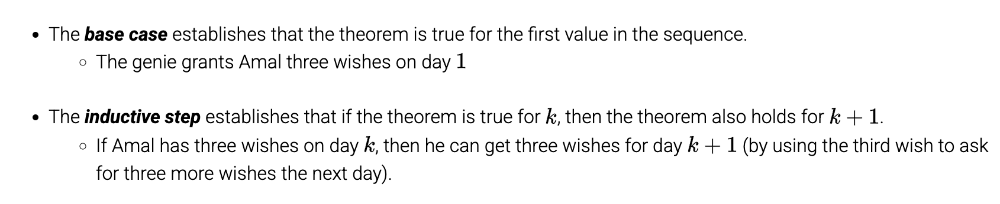
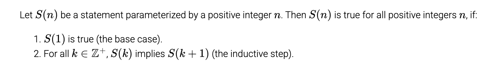

# Chapter 6: Induction and Recursion

## Table of Content

- [Chapter 6: Induction and Recursion](#chapter-6-induction-and-recursion)
  - [Table of Content](#table-of-content)
  - [6.1: Mathematical Induction](#61-mathematical-induction)
    - [Components of an Inductive Proof](#components-of-an-inductive-proof)
    - [The Idea](#the-idea)

## 6.1: Mathematical Induction

A proof technique that is useful for proving statements about elements in a sequence.

### Components of an Inductive Proof

### The Idea

If the base case and inductive step are true, then the theorem holds for all positive integers.

The inductive step implies that it holds till infinity. Supposing that S(k) as true is called the **inductive hypothesis**.

The base case is not necessarily 1 and could be different.

