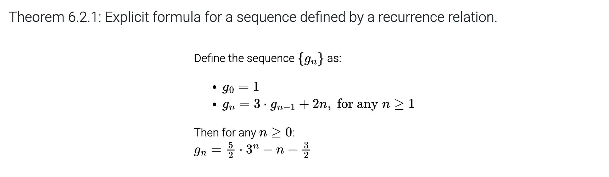
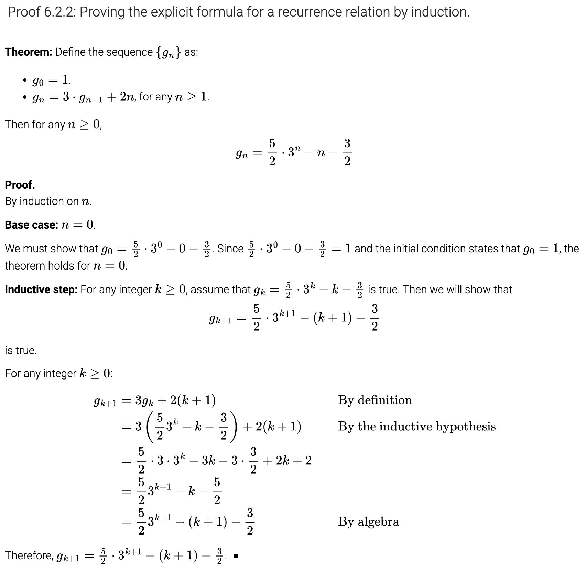
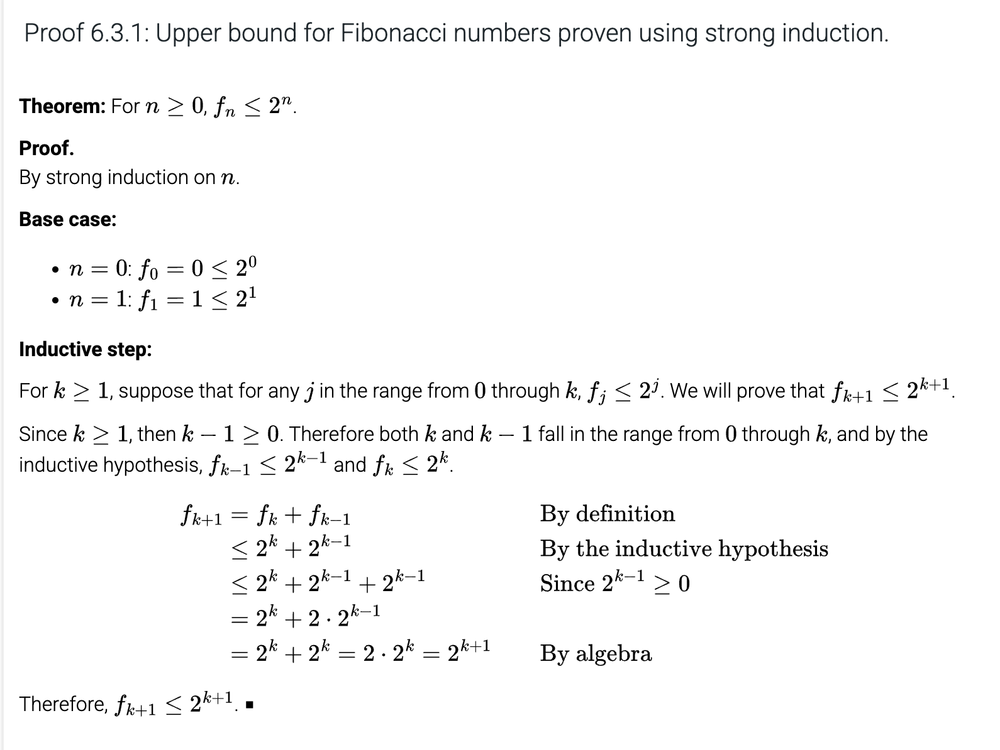
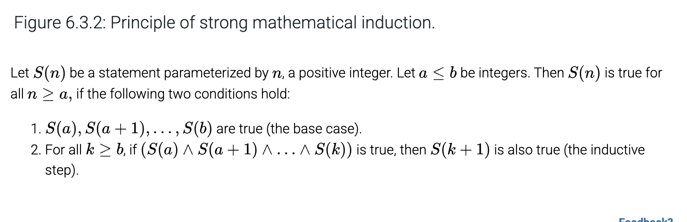
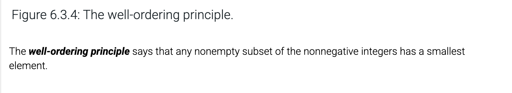

# Chapter 6: Induction and Recursion

## Table of Content

- [Chapter 6: Induction and Recursion](#chapter-6-induction-and-recursion)
  - [Table of Content](#table-of-content)
  - [6.1: Mathematical Induction](#61-mathematical-induction)
    - [Components of an Inductive Proof](#components-of-an-inductive-proof)
    - [The Idea](#the-idea)
  - [6.2: More Inductive Proofs](#62-more-inductive-proofs)
  - [6.3 Strong Induction and Well-ordering](#63-strong-induction-and-well-ordering)
    - [Strong Induction](#strong-induction)
      - [Example](#example)
      - [The Principle](#the-principle)
    - [Well-Ordering](#well-ordering)
      - [The Principle](#the-principle-1)
  - [6.4: Recursive Definitions](#64-recursive-definitions)

## 6.1: Mathematical Induction

A proof technique that is useful for proving statements about elements in a sequence.

### Components of an Inductive Proof

### The Idea

If the base case and inductive step are true, then the theorem holds for all positive integers.

The inductive step implies that it holds till infinity. Supposing that S(k) as true is called the **inductive hypothesis**.

The base case is not necessarily 1 and could be different.

## 6.2: More Inductive Proofs

Induction is well-suited to prove facts about sequences defined by recurrence relations.

Other use cases:

- Sums of arithmetic and geometric sequences
- Set Operations

## 6.3 Strong Induction and Well-ordering

In strong induction, we assume that the fact to be proven holds for all values less than or equal to $k$ not just equal.

### Strong Induction

#### Example

#### The Principle

### Well-Ordering

#### The Principle

## 6.4: Recursive Definitions
