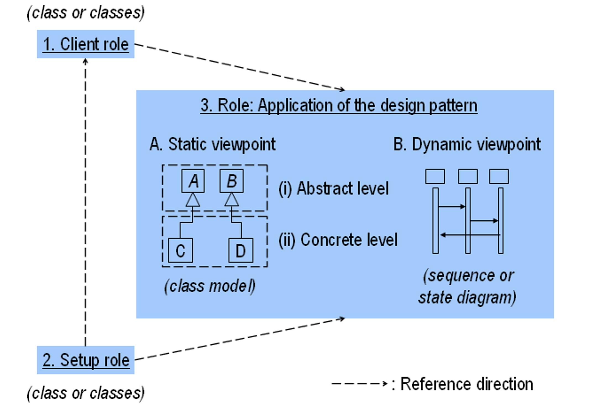
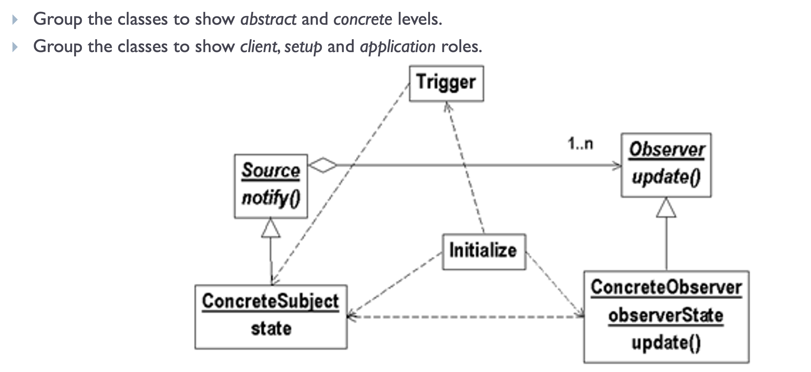
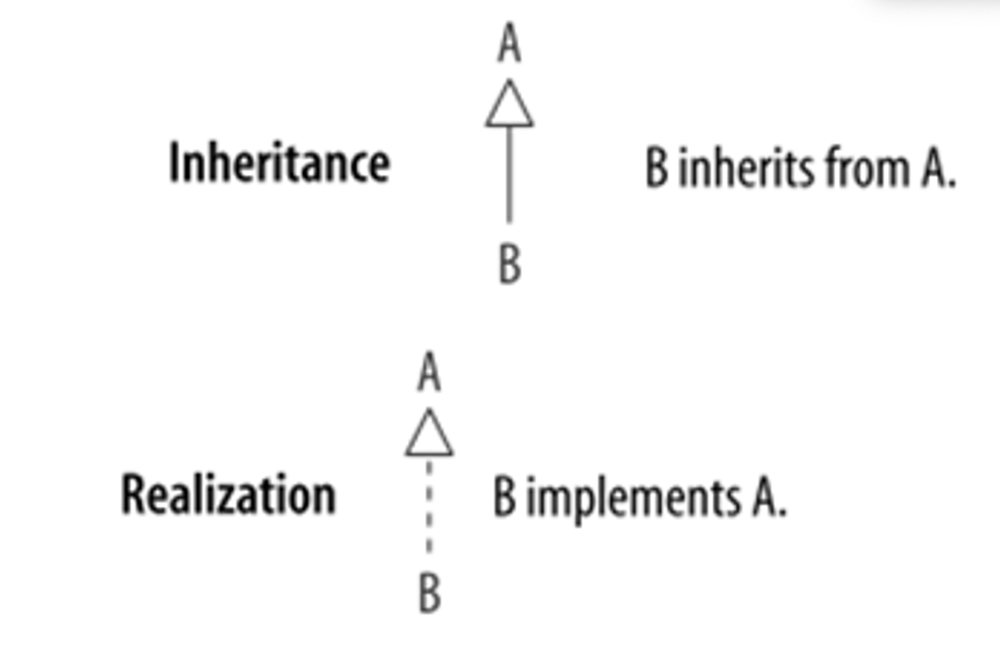
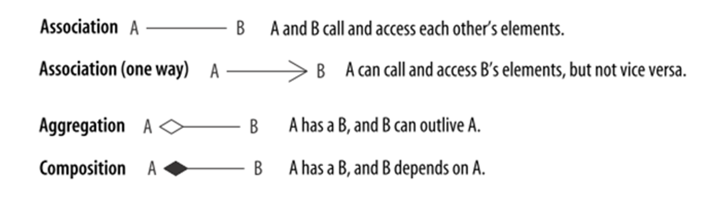

# Lecture 8: Introduction to Design Patterns

## Table of Contents

- [Lecture 8: Introduction to Design Patterns](#lecture-8-introduction-to-design-patterns)
  - [Table of Contents](#table-of-contents)
  - [Introduction](#introduction)
  - [4 main parts](#4-main-parts)
  - [Characteristics](#characteristics)
    - [Example of Roles](#example-of-roles)
    - [Example of Levels and Roles](#example-of-levels-and-roles)
  - [Tools](#tools)
  - [Two Main Forms](#two-main-forms)
    - [Delegation](#delegation)
    - [Recursion](#recursion)
  - [Types of Design Patterns](#types-of-design-patterns)
  - [Conclusion](#conclusion)

## Introduction

The idea is to build upon DP 6: reusing components. We don't want to recreate solutions that have been designed before.
Knowing these patterns give you an edge in the market. When you encounter such problems in real life, you already know patterns that solve these kind of problems.

Design patterns are class combinations and accompanying algorithms that fulfill common design purposes. Each one is designed to solve a general design problem in a particular context.

## 4 main parts

- Name
- Problem (When to use it) "also referred to as Intent"
- Solution (Elements that make up the pattern and the structure)
- Consequences (Results and trade-offs of applying the pattern)

## Characteristics

1. Viewpoints - Describe patterns with static (class model) or dynamic (sequence or state) diagrams
2. Levels - decompose the pattern into abstract (core of the pattern) or concrete (particular examples) cases
3. Roles - the agents in pattern usage: application (of the pattern), clients (of the application), and setup (initializes and controls)

### Example of Roles

### Example of Levels and Roles

## Tools

We will not learn any new things. We will use the relationships we know in class diagrams, like generalization, aggregation, dependency, and association.

## Two Main Forms

### Delegation

Basically, objects delegate (give the responsibility) tasks that are not their job to other specialized classes.
For example, a bank account class is not related to logging in database, so it delegates this task to a logger class.
Delegation comes up in many design patterns, so be aware of it.

### Recursion

Class recursion is simply when class uses itself or its parent.
For example, a folder has another folder inside it. (We will later know that the folder file relationship is actually a well-known example of the Composite Design Pattern).

## Types of Design Patterns

1. **Creational** (creating and initializing a collection of objects in a flexible way) -> Singleton

Hide details of object instantiation and adjust the object creation in some way.

2. **Structural** (collection of related objects) -> composite, decorator, and facade

Describe the organization of objects -> how classes and objects are composed to form larger structures

3. **Behavioral** (capturing behavior among a collection of objects) -> state, strategy, and observer

communication between objects during execution / difficult control flows

## Conclusion

The topic is much more complex than what is discussed here, but hopefully this discussion will inspire you to learn more and discover by yourself.
