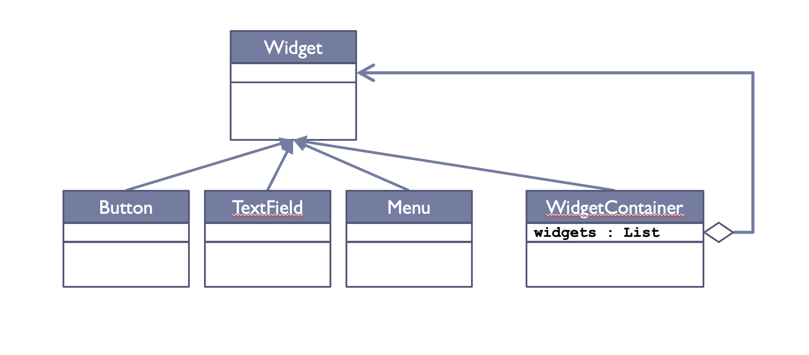
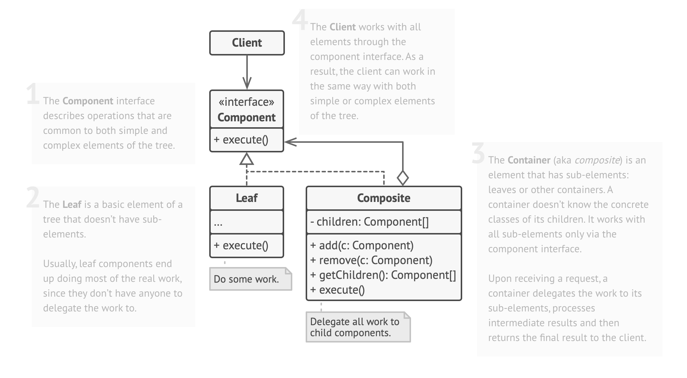
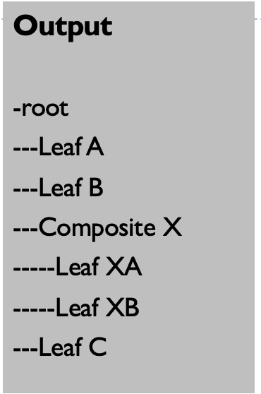

# Lecture 10: Composite Design Pattern

## Table of Content

- [Lecture 10: Composite Design Pattern](#lecture-10-composite-design-pattern)
  - [Table of Content](#table-of-content)
  - [Introduction](#introduction)
  - [Explanation](#explanation)
    - [First Choice](#first-choice)
    - [Second Choice](#second-choice)
    - [A Suggestion](#a-suggestion)
    - [Third Choice](#third-choice)
  - [An Important Discussion](#an-important-discussion)
    - [Option 1: In Component Class](#option-1-in-component-class)
    - [Option 2: In Composite Class (Folder)](#option-2-in-composite-class-folder)

## Introduction

Before discussing our second design pattern, let us recall the reason we are studying them in the first place.
As you saw in the previous lecture, the cost of reaching the 3 singleton patterns was high. 
In other words, we were deriving the design pattern step by step and saw how it took a lot of time.
In all of these patterns, others did the same job, deriving them and thinking about them step by step.
We are simply utilizing their efforts to have better design and ultimately better code.

## Explanation

This design pattern focuses on the relationship between objects like folders & files and widgets & windows.
In GUI systems, windows contain widgets or containers that contain other widgets.

### First Choice

Our first choice is to consider each window element isolated components. Note the code below:

```java
public class Window {
    Button[] buttons;
    Menu[] menus;
    TextArea[] textAreas;
    WidgetContainer[] containers;

    public void update() {
        if (buttons != null)
            for (int k = 0; k < buttons.length; k++)
                buttons[k].draw();
        if (menus != null)
            for (int k = 0; k < menus.length; k++)
                menus[k].refresh();
        if (textAreas != null)
            for (int k = 0; k < textAreas.length; k++)
                textAreas[k].type();
        // any other widget handled similarly
        if (containers != null)
            for (int k = 0; k < containers.length; k++)
                containers[k].updateWidgets();
    }
}
```

Recall our rule from before: repetition is a sign of bad design. Note that there are multiple methods for very similar functionalities.

### Second Choice

As an attempt to solve the problem, let us introduce a high level, a common interface `Widget`.
It will contain all the widgets like buttons, menus, textAreas and any others.

Our class becomes like that

```java
public class Window {
    Widget[] widgets;
    WidgetContainer[] containers;

    public void update() {
        if (widgets != null)
            for (int k = 0; k < widgets.length; k++)
                buttons[k].update();
        if (containers != null)
            for (int k = 0; k < containers.length; k++)
                containers[k].updateWidgets();
    }
}
```

Still, we have 2 different arrays and 2 for loops. There is still repetition.
This might be a sign for us that we can do better as designers.

### A Suggestion

What about the good old solution dividing them into two classes? One for the widgets `Widget` and another for the `Container`. It seems fine at first, but can it contain other containers? No. So, let us add `Container[]` inside the Class.
Oh, so we define the Container array before defining the class itself, do you notice the problem here?

Ok, let us restate the problem again. In design we need to be greedy, and we would like to have only ONE for loop in the code above.

### Third Choice

Our genius design pattern suggests the following: Hey container, you are sort of a widget. So, why don't we make you as a child of the interface `Widget`.



Since a widget Container contains widgets, we will show this via the aggregation shown above. Note the code below

```java
public class Window {
    Component[] components;

    public void update() {
        if (components != null)
            for (int k = 0; k < widgets.length; k++)
                components[k].update();
    }
}
```

Note that logically, the Container class will have a for loop to draw its children.

Here is the full graphic of the solution



To understand how beautiful and elegant this solution is, let us talk about a very famous example, folders and files. A folder contains files or other folders. The file in this example is the leaf, and the folder is the composite that contains other components, be it leaves or other composites.

## An Important Discussion

Now that we understood the design pattern, there is an important question. Where should we put the composite-specific operations? In the Component or Composite classes? To understand better, I will talk about the folder and file example.

### Option 1: In Component Class

The client treats all the components in the same way.
But since it is a parent class, all the operations will be inherited by the files as well, right? Exactly!
This means that we will need to prevent the user from using the methods on files.
We can override them and leave them empty, but this is a stupid solution (if it is a solution at all).
The logical approach is to throw errors if user attempts to add sth inside a file.
It is now the responsibility of the user to be safe with the design.

### Option 2: In Composite Class (Folder)

This is safe. The users can only add inside folders.

But, there are problems as well. Note the code below in the App.java

```java
EDOC myEDocs []; // assume the component class is EDOC

for (EDOC ed : myEDocs) {
    ed.add(); // This will give an error.
}
```

As shown above, when you have an array of components and want to add, the compiler will give an error since the methods are in the composite class (folder). So, how to adjust it? We need casting.

```java
EDOC myEDocs []; // assume the component class is EDOC

for (EDOC ed : myEDocs) {
    if (ed instanceof Folder) {
        Folder f = (Folder) ed;
        f.add();
    }
}
```

Recall, that casting and multiple if statements are hits to the performance. Thus, Option 1 is kinda preferred in this sense.

Below, is a sample full solution in C# with Option 1

```C#
// Main Parent Class
abstract class Component {
    protected string name;

    // constructor
    public Component(string name) {
        this.name = name;
    }

    // Option 1
    public abstract void Add(Component c);
    public abstract void Remove(Component c);
    public abstract void Display(int depth);
}

// Composite (Folder Class)
class Composite : Component {
    private List<Component> _children = new List<Component>();

    // constructor
    public Composite(string name) : base(name) {} // calls parent constructor

    public override void Add(Component component) {
        _children.Add(component);
    }
    public override void Remove(Component component) {
        _children.Remove(component);
    }
    public override void Display(int depth) {
        Console.WriteLine(new String('-', depth) + name);
        // displaying children
        foreach (Component component in _children) {
            component.Display(depth + 2);
        }
    }
}

// leaf class (File)
class Leaf : Component {
    // constructor
    public Leaf(string name) : base(name) {}

    public override void Add(Component component) {
        // throw error
    }
    public override void Remove(Component component) {
        // throw error
    }
    public override void Display(int depth) {
        Console.WriteLine(new String('-', depth) + name);
    }
}
```

Here is another code with Option 2.

```C#
// Main Parent Class
abstract class Component {
    protected string name;

    // constructor
    public Component(string name) {
        this.name = name;
    }

    // Option 2
    public abstract void Display(int depth);
}

// Composite (Folder Class)
class Composite : Component {
    private List<Component> _children = new List<Component>();

    // constructor
    public Composite(string name) : base(name) {} // calls parent constructor

    public override void Add(Component component) {
        _children.Add(component);
    }
    public override void Remove(Component component) {
        _children.Remove(component);
    }
    public override void Display(int depth) {
        Console.WriteLine(new String('-', depth) + name);
        // displaying children
        foreach (Component component in _children) {
            component.Display(depth + 2);
        }
    }
}

// leaf class (File)
class Leaf : Component {
    // constructor
    public Leaf(string name) : base(name) {}

    public override void Display(int depth) {
        Console.WriteLine(new String('-', depth) + name);
    }
}
```

Now, that we have our classes ready, let us build the example below in our App class.



```C#
class MainApp {
    static void Main() {
        Composite root = new Composite("root");
        root.Add(new Leaf("Leaf A"));
        root.Add(new Leaf("Leaf B"));

        Composite comp = new Composite("Composite X");
        comp.Add(new Leaf("Leaf XA"));
        comp.Add(new Leaf("Leaf XB"));

        root.Add(comp);
        root.Add(new Leaf("Leaf C"));

        Leaf leaf = new Leaf("Leaf D");
        root.Add(leaf);
        root.Remove(leaf);

        root.Display(1);
    }
}
```

Notes:

1. While subclassing both leaves and composites is perfectly valid, ensure that the essence of the design pattern is preserved: Leaves remain without children and composites continue to manage child components.