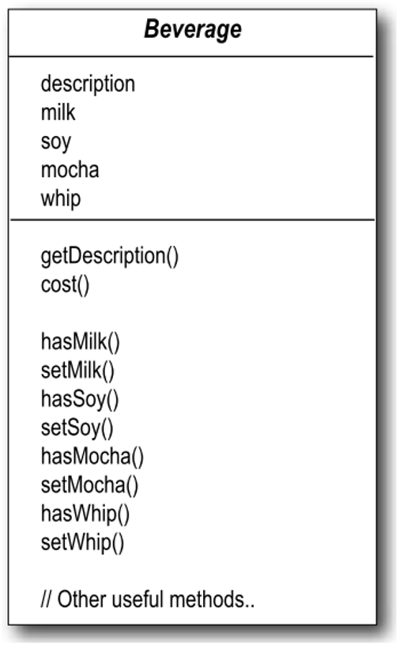
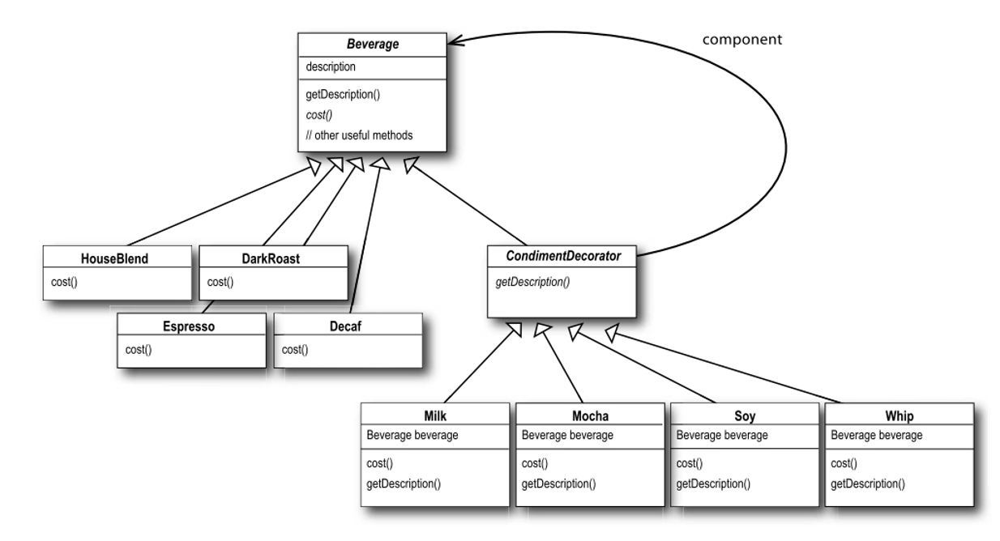

# Lecture 11: Decorator Design Pattern

## Table of Contents

- [Lecture 11: Decorator Design Pattern](#lecture-11-decorator-design-pattern)
  - [Table of Contents](#table-of-contents)
  - [Problem Description](#problem-description)
  - [Option 1](#option-1)
  - [Option 2](#option-2)
  - [Option 3 - Decorator Design Pattern](#option-3---decorator-design-pattern)
    - [Beverage Class](#beverage-class)
    - [Flavor (Decorator) Class](#flavor-decorator-class)
    - [Concrete Beverages Classes](#concrete-beverages-classes)
    - [Concrete Flavors](#concrete-flavors)

## Problem Description

Assume the following scenario. You have a coffee shop that is offering different beverages.
Being a good designer, you created a parent `Beverage` that has all beverage types as children, like Espresso, Latte, and Machiatto.
But now, you are thinking of adding flavors, like Vanilla, Caramel, or Milk.

## Option 1

The first idea that comes to your mind is through subclassing even more.
So, you will have EspreesoWithVanilla, EspressoWithCaramel, EspressorWithMilk, and so on for every combination of beverage and flavor.

I bet you recognize the problem by now. We will have a lot of classes to the point that we will stop following what is going on. This phenomenon is called **Class Explosion**, which should be avoided at all costs.

## Option 2

Recall, that we want to add properties (flavors) to those beverages. Why don't we add them as boolean flags in the parent class?

This is a brief sketch of the Beverage class with this method:



Recall our open-closed principle. A class should be open for extension but not modification.
In this solution, for every new flavor we will need to add properties and methods in the Beverage class. Thus, this option violates the open-closed principle.

## Option 3 - Decorator Design Pattern

Our elegant solution is this lecture's design pattern. Basically, we will enclose the flavors in another object that adds functionality.

So, basically a Flavor Abstract class will be added as a child of the Beverage. The children of this Flavor will be the Caramel, Milk, Vanilla, and any flavors we would like to add in the future. Below is a sketch of our solution.



Now, no modification required anymore. Whenever we want to add a new beverage or flavor, we add a new class.

Let us look at the code

### Beverage Class

```java
public abstract class Beverage {
    String description = "Unknown Beverage";

    public String getDescription() {
        return description;
    }

    public abstract double cost();
}
```

### Flavor (Decorator) Class

```java
public abstract class CondimentDecorator extends Beverage {
    public abstract String getDescription();
    // Note that no need to implement cost here.
}
```

### Concrete Beverages Classes

```java
public class Espresso extends Beverage {
    public Espresso() {
        description = "Espresso";
    }

    public double cost() {
        return 1.99;
    }
}

public class Latte extends Beverage {
    public Latte() {
        description = "Latte";
    }

    public double cost() {
        return 0.89;
    }
}
```

### Concrete Flavors

```java
public class Caramel extends CondimentDecorator {
    Beverage beverage;

    // Enforce that it is always called with drink not by itself
    public Caramel(Beverage beverage) {
        this.beverage = beverage;
    }

    public String getDescription() {
        return beverage.getDescription() + ", Caramel";
    }

    public double cost() {
        return 0.2 + beverage.cost();
    }
}
```

Now, in order to create drinks, we construct them like a lego. Look at how the application below does exactly that.

```java
public class CoffeeShop {
    public static void main (String args[]) {
        Beverage beverage = new Espresso(); // base drink
        System.out.println(beverage.getDescription() + " $" + beverage.cost());

        Beverage beverage2 = new Latte();
        beverage2 = new Caramel(beverage2);
        beverage2 = new Caramel(beverage2); // double caramel shot
        beverage2 = new Vanilla(beverage2);
        System.out.println(beverage2.getDescription() + " $" + beverage2.cost());

        // At this moment, beverage2 is an instanceof Vanilla ONLY.

        // If we want to remove the Vanilla shot. Maybe, the customer did not want it anymore.
        beverage2 = beverage2.beverage; // Quite elegant!
    }
}
```