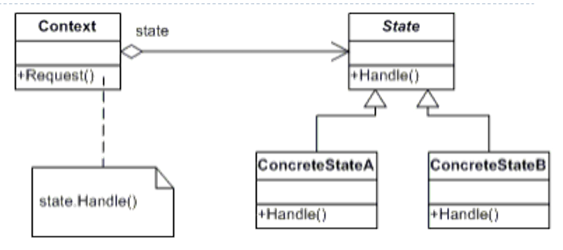

# Lecture 12: State Design Pattern

## Table of Contents

- [Lecture 12: State Design Pattern](#lecture-12-state-design-pattern)
  - [Table of Contents](#table-of-contents)
  - [Introduction \& Motivation](#introduction--motivation)
  - [The Idea](#the-idea)
  - [Application](#application)

## Introduction & Motivation

In every problem we tried to solve till now, we had a clear vision of what is required from our program.
However, sometimes it is not very clear and we might face unexpected things.

Take as an example: a Gumball Machine. Let us try to identify the states of such a machine.
Let us assume the following four: No Quarter, Has Quarter, Out of Gumballs, Gumball Sold.
At any time, our machine is at one of these states. We need to try and visualize what happens in our code.

```java
// Below are 4 constants representing the 4 states
final static int SOLD_OUT = 0; // out of gumballs
final static int NO_QUARTER = 1;
final static int HAS_QUARTER = 2;
final static int SOLD = 3; // gumball sold

// This is the current state. When the machine first starts, it is sold out since it is unfilled
int state = SOLD_OUT;
```

Now, if we think about the different actions we need, we might come up with: inserts quarter, turns crank, ejects quarter, and dispense.
Note that these actions cause the transition from a state to another.

Note the code below:

```java
// This is just ONE METHOD !!!
public void insertQuarter() {
    if (state == HAS_QUARTER) {
        System.out.println("You can't insert another quarter.");
    } else if (state == SOLD_OUT) {
        System.out.println("You can't insert a quarter, the machine is sold out.");
    } else if (state == SOLD) {
        System.out.println("Please wait, we're already giving you a gumball.");
    } else if (state == NO_QUARTER) {
        state = HAS_QUARTER;
        System.out.println("You inserted a quarter.");
    }
}
```

Ok, notice first that there a lot of if statements, which as discussed earlier is a sign of bad design.

One of the best ways to assess the design is through a maintenance scenario. Imagine we get a new instruction: "One in ten people should get a FREE gumball."

1. You will need to add a new state.
2. You will also need to add some modifications to every if statement and every method.

That is a LOT of code work. The fact that you are suffering because of a maintenance scenario should give you a hint that your design was initially terrible.

So, what is the solution to this dilemma?
**STATE DESIGN PATTERN!**

## The Idea

So, we want some sort of object that changes its behavior when its internal state changes.
An idea is every branch of the if statements should be in an individual class somehow.
If we isolate them, it will be a much better design.

Note the class diagram below:



So, we introduce an upper interface layer to our 4 states. We will use an instance of that interface layer inside our main context class.

Look at the beautiful code below:

```C#
// state upper layer
abstract class State {
    public abstract void Handle(Context context);
}

// 2 states for demo
class ConcreteStateA : State {
    public override void Handle(Context context) {
        context.State = new ConcreteStateB();
    }
}

class ConcreteStateB : State {
    public override void Handle(Context context) {
        context.State = new ConcreteStateA();
    }
}

// context class
class Context {
    // current state variable
    private State _state;

    // constructor
    public Context (State state){
        this.State = state;
    }

    // getter and setter in C#. Don't worry about the syntax
    public State State {
        get { return _state; }
        set {
            _state = value;
            Console.WriteLine("State: " + _state.GetType().Name);
        }
    }

    public void Request() {
        _state.Handle(this);
    }
}

// main app
class MainApp {
    static void Main() {
        // Setup context in a state
        Context c = new Context(new ConcreteStateA());

        c.Request();
        c.Request();
        c.Request();
        c.Request();
    }
}

```

## Application

Before applying the idea to our gumball example, let us discuss a few things.

Notice that the State class gets the request then **delegates** it to the children classes.
Another thing, the State class does NOT have a lot of arrows going outside of it.
Usually, these classes are highly reusable and are used by other classes severely.

In every class, we are now focusing on a single scenario rather than modifying and having if statements.

Note the "No Quarter" state and the Gumball Machine as an example below

```java
public class NoQuarterState implements State {
    GumballMachine gumballMachine; // This is circular reference and bad practice actually. It should have been in the parent better.

    public NoQuarterState(GumballMachine gumballMachine) {
        this.gumballMachine = gumballMachine;
    }

    public void insertQuarter() {
        System.out.println("You inserted a quarter.");
        gumballMachine.setState(gumballMachine.getHasQuarterState());
    }

    public void ejectQuarter() {
        System.out.println("You haven't inserted a quarter.");
    }

    public void turnCrank() {
        System.out.println("You turned, but there's no quarter.");
    }

    public void dispense() {
        System.out.println("You need to pay first.");
    }
}

public class GumballMachine {
    // Notice that instead of constants, we have classes to represent states
    State soldOutState = new SoldOutState(this);
    State noQuarterState = new NoQuarterState(this);
    State hasQuarterState = new HasQuarterState(this);
    State soldState = new SoldState(this);

    State state = soldOutState;
    int count = 0;

    public GumballMachine(int numberGumballs) {
        this.count = numberGumballs;
        if (numberGumballs > 0) {
            state = noQuarterState;
        }
    }

    // Getters and setters of all variables are assumed to be implemented

    public void insertQuarter() {
        state.insertQuarter();
    }

    public void ejectQuarter() {
        state.ejectQuarter();
    }

    public void turnCrank() {
        state.turnCrank();
        state.dispense();
    }
    void setState(State state) {
        this.state = state;
    }

}
```

Note how elegant did the code become. This is the State Design Pattern and its beauty.
