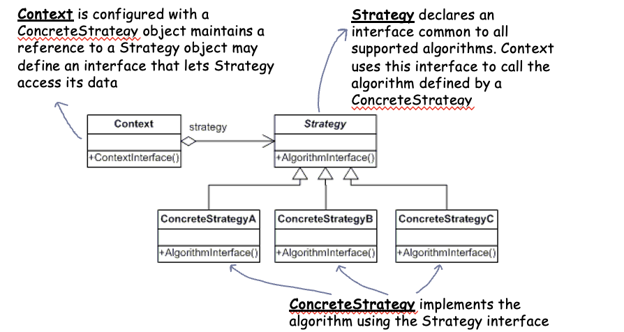

# Lecture 13: Strategy Design Pattern

## Table of Contents

- [Lecture 13: Strategy Design Pattern](#lecture-13-strategy-design-pattern)
  - [Table of Contents](#table-of-contents)
  - [Introduction \& Motivation](#introduction--motivation)

## Introduction & Motivation

Let us think about the Java Swing package.

This package has different components like frames, panels, buttons, lists, etc.
It also has many types of borders: bevel, etched, line, tilted etc.
The border are drawn using `JComponent.paintBorder()`. Each component has a border of some type.

How would you try to implement such a library?

What do you think about the following code?

```java
protected void paintBorder(Graphics g) {
    switch(getBorderType()) {
        case LINE_BORDER:
            paintLineBorder(g);
            break;
        case ETCHED_BORDER:
            paintEtchedBorder(g);
            break;
        // continue the cases
    }
}
```

Doesn't this amount of conditions ring a bell? Yes, we discussed them in the State Design Pattern.
There, we also said how a lot of conditions mean a bad design. We broke the logic to classes and introduced an upper interface.

Can we apply a similar logic here? Let us try.

Every conditional will be removed to its separate class.
Note the class diagram below:



Weird. Doesn't this look exactly like the State?
Yes, but there are subtle differences we will discuss after looking at the code.

This is a general code:

```C#
// strategy upper layer
abstract class Strategy {
    public abstract void AlgorithmInterface();
}

// 3 Strategies for demo
class ConcreteStrategyA : Strategy {
    public override void AlgorithmInterface() {
        Console.WriteLine("Called ConcreteStrategyA." + "AlgorithmInterface()");
    }
}

class ConcreteStrategyB : Strategy {
    public override void AlgorithmInterface() {
        Console.WriteLine("Called ConcreteStrategyB." + "AlgorithmInterface()");
    }
}

class ConcreteStrategyC : Strategy {
    public override void AlgorithmInterface() {
        Console.WriteLine("Called ConcreteStrategyC." + "AlgorithmInterface()");
    }
}

// context class
class Context {
    // current Strategy variable
    private Strategy _strategy;

    // constructor
    public Context (Strategy strategy){
        this._strategy = strategy;
    }

    public void ContextInterface() {
        _strategy.AlgorithmInterface();
    }
}

// main app
class MainApp {
    static void Main() {
        // Setup context in a Strategy
        Context context;

        // Three contexts followed by different strategies
        context = new Context(new ConcreteStrategyA());
        context.ContextInterface();

        context = new Context(new ConcreteStrategyB());
        context.ContextInterface();

        context = new Context(new ConcreteStrategyC());
        context.ContextInterface();

    }
}
```

Now, no if statements exist anymore.

Did you figure out the difference with State?

Notice that a strategy has No reference to the context at all. The border does not know what component will use it. In State, the states are aware of the context and there's circular reference if you remember.

Another very important difference is that states know about each other. Strategies have no link between themselves.

If you have a system that requires states and transitions between them, then it follows the state design pattern.
If it needs different algorithms to handle different situations, then it is a strategy design pattern.
