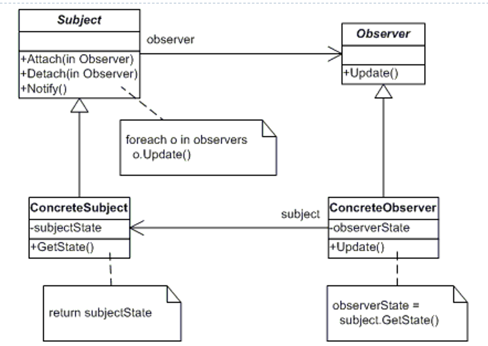

# Lecture 14: Observer Design Pattern

## Table of Contents

- [Lecture 14: Observer Design Pattern](#lecture-14-observer-design-pattern)
  - [Table of Contents](#table-of-contents)
  - [Introduction](#introduction)
    - [Class Diagram 1](#class-diagram-1)
    - [Class Diagram 2](#class-diagram-2)
    - [Class Diagram 3](#class-diagram-3)
  - [The Solution](#the-solution)
  - [Consequences](#consequences)
  - [Sample Code](#sample-code)
  - [Brief Discussion: Pull Vs Push](#brief-discussion-pull-vs-push)

## Introduction

If I have some data, and I want to represent it using different graphs (observers), how will I do that?

Let us examine the class diagram below:

### Class Diagram 1

Assume I have a Data class, a BarChart class, and an App class.
The Data class has data private variables (a, b, c) and has setter for each data.
I want to add a graph that will use this data, so I add a private `BarChart br` variable and inside the setter I add `br = update()`, which will update the graph whenever the data changes.

What do you notice?

The Data class does not follow the open closed principle. When we add any other observer (graph), we will need to modify it.
It also violates Single Responsibility, since some code is used to assign data (data logic) and other is used to update charts (viewing logic).

This is HORRIBLE DESIGN. Even if the compiler says everything is fine, you should be able to see by now how bad this design is.

### Class Diagram 2

Ok, another idea might be to shift the viewing logic into the App. Now, my Data class only has data logic. In the App, whenever I call `data.set()` for any data variable, I write after it `br.update()`. So, the update logic is now in the App class. The person who does this usually thinks that having multiple responsibilities in the App class is fine.

Well, you need to write the update line after every setting. You are repeating this single line throughout your project. This violates abstraction, as the graph (any observer) should be updated whenever you set. You shouldn't update it manually!!!

### Class Diagram 3

What about having a `while(True)` loop that keeps updating the barChart? You are checking forever even though updates don't necessarily happen that frequently.

## The Solution

So, what is the magical solution we will follow this time? As usual, have an upper layer. I will have an Observer class, and any new graph would simply inherit it.
The Data class uses instances of the Observer class and calls `notifyObserver()` in every setter. By polymorphism, the virtual machine updates the observers without knowing how exactly or who is he notifying.

Here is a general class diagram for the Observer Pattern:



The Subject (it was the Data Class). It provides an interface for attaching and detaching Observers.
The Observer defines and interface for objects (in the previous example they were graphs) that should be notified of change.
The ConcreteSubject (think of it as a specific type of Data) sends a notification to the observers (graphs) when the state changes.
The ConcreteObserver (special type of Graph) has a reference to ConcreteSubject (Of course, a graph needs to know about the data) and implements Observer design pattern to keep its interface consistent with the subject (data).

## Consequences

It maybe inefficient when only few observers need to react to change in subjects.

## Sample Code

```C#
abstract class Subject {
    private List<Observer> _observers = new List<Observer>();

    public void Attach(Observer observer) {
        _observers.Add(observer);
    }

    public void Detach(Observer observer) {
        _observers.Remove(observer);
    }

    public void Notify() {
        foreach (Observer o in _observers) {
            o.Update();
        }
    }
}

class ConcreteSubject : Subject {
    private string _subjectState;

    public string SubjectState {
        get {return _subjectState; }
        set {_subjectState = value; }
    }
}

abstract class Observer {
    public abstract void Update();
}

class ConcreteObserver : Observer {
    private string _name;
    private string _observerState;
    private ConcreteSubject _subject;

    public ConcreteObserver (ConcreteSubject subject, string name) {
        this._subject = subject;
        this._name = name;
    }

    public override void Update() {
        _observerState = _subject.SubjectState;
        Console.WriteLine("Observer {0}'s new state is {1}", _name, _observerState);
    }

    public ConcreteSubject Subject {
        get { return _subject; }
        set { _subject = value; }
    }
}

class MainApp {
    static void Main() {
        ConcreteSubject s = new ConcreteSubject();
        s.Attach(new ConcreteObserver(s, "X"));
        s.Attach(new ConcreteObserver(s, "Y"));
        s.Attach(new ConcreteObserver(s, "Z"));

        s.SubjectState = "ABC";
        s.Notify();

    }
}
```

```java
interface Observer {
    public void update(Subject s);
}

class ObserverImp1 implements Observer {
    private String state = "";

    public void update(Subject s) {
        state = s.getState();
        System.out.println("Update received from " + "Subject, state changed to: " + state);
    }
}

interface Subject {
    public void addObserver(Observer o);
    public void removeObserver(Observer o);
    public String getState();
    public void setState(String state);
}

class SubjectImp1 implements Subject {
    private List observers = new ArrayList();
    private String state = "";

    public String getState() { return state; }
    public void setState(String state) {
        this.state = state;
        notifyObservers();
    }

    public void addObserver(Observer o) { observers.add(o);}
    public void removeObserver(Observer o) {observers.remove(o);}

    public void notifyObservers() {
        Iterator i = observers.iterator();
        while (i.hasNext()) {
            Observer o = (Observer) i.next();
            o.update(this);
        }
    }
}

public class ObserverTest {
    public static void main(String[] args) {
        Observer o = new ObserverImp1();

        Subject s = new SubjectImp1();

        s.addObserver(o);

        s.setState("New State");
    }
}
```

## Brief Discussion: Pull Vs Push

The Push Model: Subjects send to observers whenever they get updated, regardless if the observer asks for it or not.
Like the Java Implementation above.

The Pull Model: When the observer asks, it gets the info from the subject.
Like the C# Implementation above.
This might not be beneficial for multithreading environments, but most applications use this method not to overwhelm the receiver with data unnecessarily.