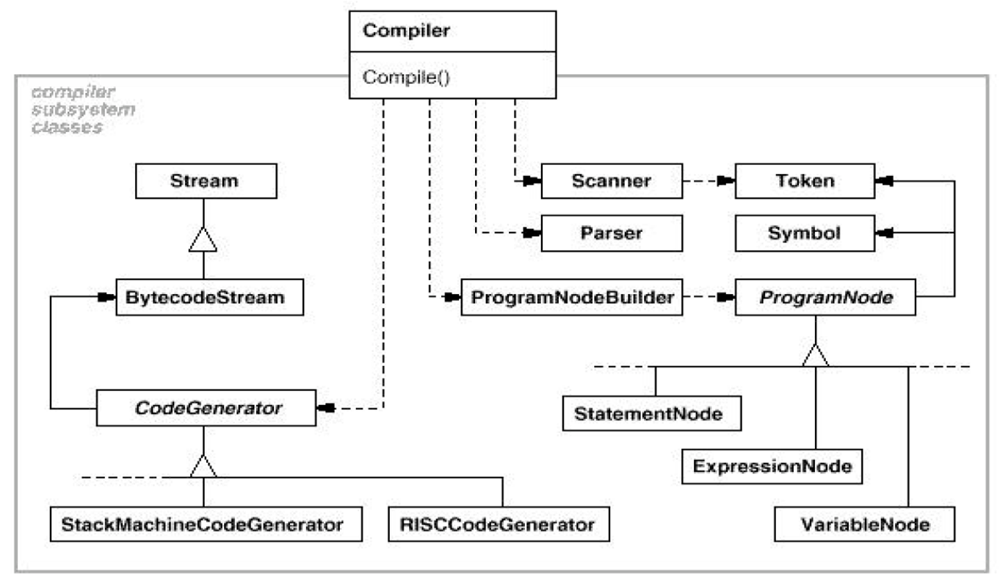
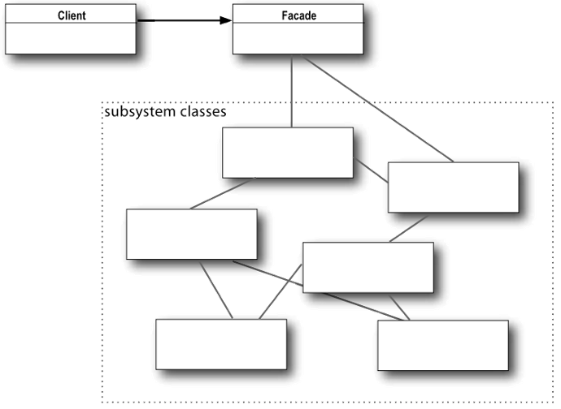

# Lecture 15: Facade Design Pattern

## Table of Contents

- [Lecture 15: Facade Design Pattern](#lecture-15-facade-design-pattern)
  - [Table of Contents](#table-of-contents)
  - [Introduction](#introduction)
  - [Motivation](#motivation)
  - [Advantages](#advantages)
  - [The Pattern](#the-pattern)
  - [Sample C# Code](#sample-c-code)
  - [The Principle of Least Knowledge (Law of Demeter)](#the-principle-of-least-knowledge-law-of-demeter)
  - [Summary](#summary)

## Introduction

This time, we are not discussing a solution to a problem but rather an approach that exists in systems.

Examine the image below:



A compiler absorbs many different code files and indicates errors.
As a user, you just have to click on the compile or run button, and it does everything under the hood.
You don't really know how it is detecting errors.

Let us try to think like a compiler. Look at the code below.

```java
int x = 0;
```

As a compiler, you view the line above as a type (int), var name (x), initialization (= 0).
But this way of viewing is actually just the parser. For example, the line below is correct in the eyes of the Parser:

```java
Strong x = "k";
```

The fact that Strong is not a valid type is not the Parser's job. Another guy called the TypeChecker gives an error because it should be String not Strong.

The idea is there are a lot of components working together to make a successful compiler.
Some compilers require 40+ passes until we get "Process completed."

## Motivation

As we discussed above, a compiler system is so complex. Yet, using it is very simple. As a user you don't really care about details like parsing and code generation.

From this idea, a facade design pattern came to birth. This French word means "face".

The idea is that a facade is an object that provides a simplified interface to a larger body of code, which is technically under the definition of encapsulation.

It is just an interface or class that is used for interacting & encapsulating a system. It should NOT include any new features.

## Advantages

1. I can easily adjust the classes inside the system.
2. Limiting the interaction with the inner classes.
3. It is easier to use the complex system in this way.

By the way, we can choose some classes to be visible to the outside classes. This doesn't violate the facade design pattern but is an available flexibility.

## The Pattern



When given a request, the facade delegates this task to the appropriate classes within the system.
The system classes have no knowledge of the facade. They don't have any references to it.

It shields the client from the subsystem components and makes the subsystem easier to use.

Less arrows from subsystem in the class diagram -> less (weaker) coupling -> better design and less headache in the future

As we said before, this doesn't mean that applications cannot use the subsystem components if they need to.

## Sample C# Code

```c#
class SubSystemOne {
    public void MethodOne() {
        Console.WriteLine(" SubSystemOne Method");
    }
}

class SubSystemTwo {
    public void MethodTwo() {
        Console.WriteLine(" SubSystemTwo Method");
    }
}

class SubSystemThree {
    public void MethodThree() {
        Console.WriteLine(" SubSystemThree Method");
    }
}

class SubSystemFour {
    public void MethodFour() {
        Console.WriteLine(" SubSystemFour Method");
    }
}

// Below is the KEY CLASS
class Facade {
    private SubSystemOne _one;
    private SubSystemTwo _two;
    private SubSystemThree _three;
    private SubSystemFour _four;

    public Facade() {
        _one = new SubSystemOne();
        _two = new SubSystemTwo();
        _three = new SubSystemThree();
        _four = new SubSystemFour();
    }

    public void MethodA() {
        Console.WriteLine("\nMethodA () ---- ");
        _one.MethodOne();
        _two.MethodTwo();
        _four.MethodFour();
    }

    public void MethodB() {
        Console.WriteLine("\nMethodB () ---- ");
        _two.MethodTwo();
        _three.MethodThree();
    }
}

class MainApp {
    Facade facade = new Facade(); // client only deals with facade

    facade.MethodA();
    facade.MethodB();
}
```

## The Principle of Least Knowledge (Law of Demeter)

It says: "Talk only to your immediate friends".

We should only invoke methods that belong to:

- The object itself
- Objects passed in as parameters to the method
- Any object the method creates or instantiates
- Any components of the object (HAS A relationship)

Let us discuss an example to drive the point home. Consider three people: Khalid, Saud, and Omar. Omar creates a class named `Thermometer`, Saud creates `Station`, and Khalid creates `App`. Khalid has the method below in his class.

```java
public float getTemp() {
    return station.getThermometer().getTemperature();
}
```

Do you notice any problem in this method? Let us rewrite it to better visualize the problem.

```java
public float getTemp() {
    Thermometer t1 = station.getThermometer();
    t1.getTemperature();
}
```

Why do I have a reference of the Thermometer class in the App? The `App` should only use the `Station`, and the `Station` uses the `Thermometer`.
Suppose you want to change the `Thermometer` into another `FancyThermometer` class. You will affect anyone using the Station class since they used it considering that the `station.getThermometer()` returns a `Thermometer` object.

Instead of this violation of Least Knowledge Principle, Saud decides to create a `getTemperature` method that extracts the temperature from the a thermometer object. Khalid's method becomes like the one below.

```java
public float getTemp() {
    return station.getTemperature();
}
```

In this way, no unnecessary coupling exists and every one deals with one class. Khalid -> Saud -> Omar.

## Summary

1. Facade design pattern makes a software library easier to use and understand.
2. It can reduce dependencies of outside code on the inner components of a library since most code uses the facade. This allows for more flexibility in developing a system using a library.
3. Facade can wrap a poorly designed collection of APIs with a single well-designed API.