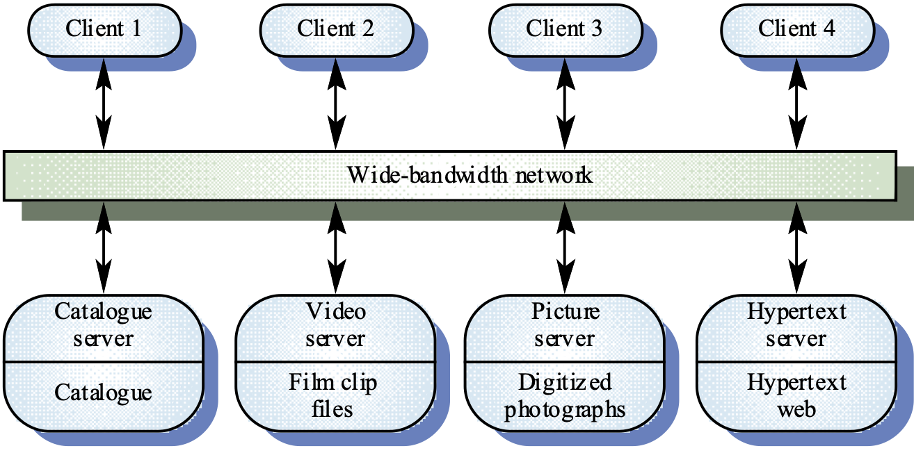
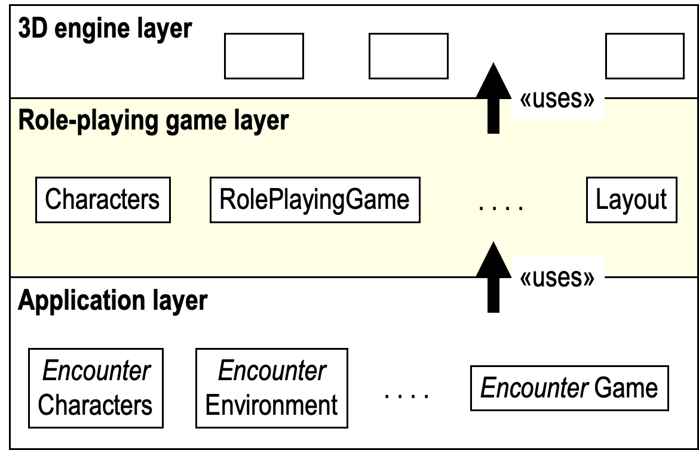

# Lecture 16: Architectures

## Table of Contents

- [Lecture 16: Architectures](#lecture-16-architectures)
  - [Table of Contents](#table-of-contents)
  - [Introduction](#introduction)
  - [Software Architecture](#software-architecture)
    - [Goals of Decomposition](#goals-of-decomposition)
    - [Advantages of Explicit Architecture](#advantages-of-explicit-architecture)
  - [Classifications of Software Architecture](#classifications-of-software-architecture)
    - [1. Data Flow Architecture](#1-data-flow-architecture)
    - [2. Repository Architecture](#2-repository-architecture)
    - [3. Independent Component Architecture](#3-independent-component-architecture)
      - [Advantages](#advantages)
      - [Disadvantages](#disadvantages)
      - [Example](#example)
    - [4. Layered Architecture](#4-layered-architecture)
      - [Example](#example-1)

## Introduction

In software development, there are several stages like Requirements Analysis, Design, and Implementation.
In this course, we have been talking about Design.
This phase includes framework, architecture, and detailed design.
In this chapter, we discuss architecture.

An **architecture** for a software application is its high-level design, enabling software engineers to gain understanding of the whole system.

It is the link between specification and design processes.

The output of the architectural design is the description of the software architecture.

We can think of it as decomposing a large application into a small number of packages (class collections).

To visualize this, when you want to build a house, you first sketch some boxes before discussing the details of each room and furniture.

In a framework, you divide your system into subparts where each part is a logical unit. For example, a KFUPM system might be divided into clinic subsystem, registrar, and so on.

A video store application could be divided into Videos, Rentals, and Customers subsystems. Now, we can think about each one individually, making the software process easier and smoother.

## Software Architecture

It solves the problem of complexity by dividing (modularizing) the system into logical units.

### Goals of Decomposition

There are 2 goals for this decomposition: cohesion & coupling.

**Cohesion** within a module is the degree to which communication takes place among the module's elements.

**Coupling**: the degree to which modules depend directly on other modules.

Effective modularization means maximizing cohesion and minimizing coupling.

### Advantages of Explicit Architecture

- Stakeholder communication
- Large-scale reuse
- System analysis (Can I implement my system as I want?)

## Classifications of Software Architecture

There are 5 main architectures:

1. Data Flow
2. Independent Components
3. Virtual Machines
4. Repositories
5. Layered

We will focus on each one individually except number 3.

### 1. Data Flow Architecture

This is an outdated architecture, but its main ideas are useful in general.

Basically, functions help each other in a sequential way. input -> functionA -> functionB -> ... etc.

### 2. Repository Architecture

It is still being used.

It is basically when the system is built around a large data collection.
Each application (subsystem) exchange data. Either they share data with a central database or the subsystem has its own database, especially in sensitive info situations.

When large amount of data are to be shared, the repo model of sharing with a central database is most commonly used.

### 3. Independent Component Architecture

A system is divided into components that function in parallel and could occasionally communicate.

A very famous example is the Client-Server architecture. Servers provide services like printing, data management, etc.
Clients call on these services.
The observer design pattern is of potential use in independent component architectures.

#### Advantages

- Effective use of networked systems.
- Easy to add new servers or upgrade existing servers (since each one is an individual unit)

#### Disadvantages

- No shared data model, so every subsystem uses different data organization.
- Redundant management in each server.
- No central register of names and services - it might be hard to find out what servers and services are available.

#### Example

### 4. Layered Architecture

Each subsystem depends one-way on another subsystem.
Each layer uses other layers and is used by other layers.
Building applications layer by layer simplifies the implementation process.

#### Example

