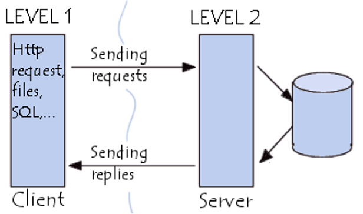
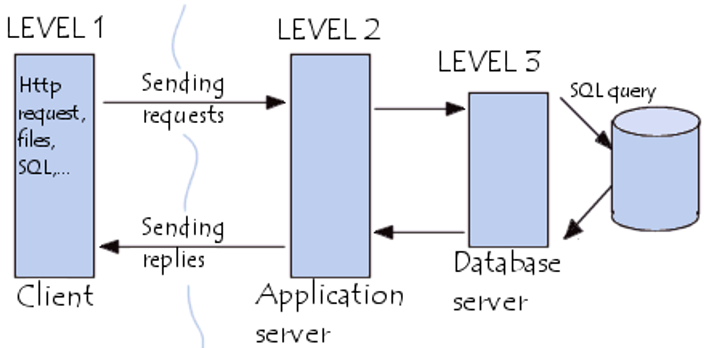
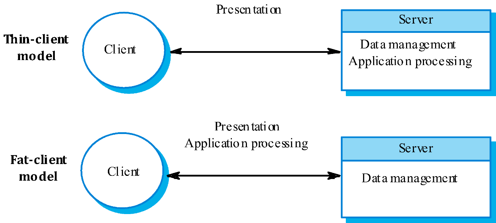
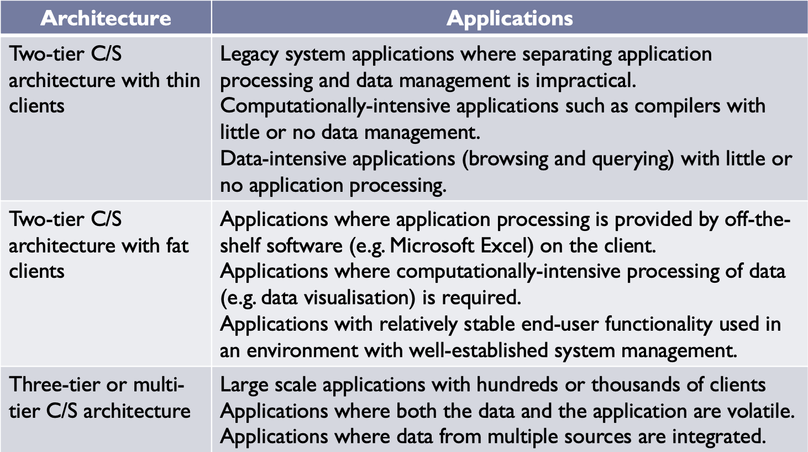

# Lecture 17: Client-Server Architecture

## Table of Contents

- [Lecture 17: Client-Server Architecture](#lecture-17-client-server-architecture)
  - [Table of Contents](#table-of-contents)
  - [Client-Server Architecture](#client-server-architecture)
  - [Two Tier Architecture](#two-tier-architecture)
    - [Example: HTTP Requests](#example-http-requests)
    - [Advantages](#advantages)
    - [Disadvantages](#disadvantages)
  - [Three Tier Architecture](#three-tier-architecture)
    - [Advantages](#advantages-1)
    - [Disadvantages](#disadvantages-1)
  - [Thin and Fat Clients](#thin-and-fat-clients)

## Client-Server Architecture

In the past, software used to reside in a certain machine. In the early 90s, internet was introduced and sharing of data became available.

A set of services provided by servers and a set of clients that use these services. It follows logically that clients need to know about these servers and services to use them.

Examples: email exchange, web access, database access

**Clients**: web browsers, email clients, and online chat clients.
**Servers**: web servers, ftp servers, application servers, database servers, name servers, mail servers, file servers, print servers, and terminal servers.

Application layers: Presentation layer, Application processing layer, and Data management layer.

These three layers could be used in several systems.

There are 2 types of Client-Server architectures discussed in further detailed below.

## Two Tier Architecture

Application components are distributed between the server and client software.

Server also stores data and manages all data accesses and contains a lot of data intensive tasks.

Clients handle presentation (UI) and contain a lot of the application logic. SQL is used by clients to request subsets of data from server.
Data returned by server is manipulated by the client for reporting.

### Example: HTTP Requests

Processing of HTML code is on the client side and the web page request is processed on the server side.

### Advantages

- Fast app development time
- Available tools are robust and provide fast prototyping

### Disadvantages

- Not suitable for different environments with rapidly changing business rules
- Client contains a lot of application logic, so the client software version control is difficult.

## Three Tier Architecture

Separates presentation, processing, and data into 3 distinct entities.

Allows for a better performance than a thin-client approach and is simpler to manage than a fat-client approach.

Client handles the presentation using similar tools as in the 2-tier.

When data is required by the presentation layer, a call is made to the middle-tier functionality server.

Middle tier servers may be multithreaded and can be accessed by multiple clients.

RPCs (remote procedure calls) handle calling mechanism from client to server and from server to server. It is more general than the SQL calls used by 2-tier.

### Advantages

- The 3-tier clients do not have to know SQL because of RPCs.
- Separation between servers allow for parallel development of individual tiers by application specialists.
- Reusable components reduce development and migration costs.

### Disadvantages

- Creates an increased need for network traffic management, server load balancing, and fault tolerance.
- Tools are complex
- Maintenance tools are inadequate and hard as well.

## Thin and Fat Clients

There are two types of clients whenever we are talking about client-server architecture: thin and fat clients.

In a thin model, all of the application processing and data management is carried out on the server. The client is only responsible for the presentation (UI).

In a fat/thick model, the server is only responsible for data management. The software on the client implements the application logic and the interactions with the system user.

