# Lecture 18: Software Construction

## Table of Contents

- [Lecture 18: Software Construction](#lecture-18-software-construction)
  - [Table of Contents](#table-of-contents)
  - [Software Construction](#software-construction)
  - [Coding Standards](#coding-standards)
  - [Snapshot Diagrams](#snapshot-diagrams)
    - [Primitive Values](#primitive-values)
    - [Object Values](#object-values)
    - [Immutable and Mutable Values](#immutable-and-mutable-values)
    - [Immutable References (Constants)](#immutable-references-constants)
  - [Specifications](#specifications)
    - [Behavioral Equivalence](#behavioral-equivalence)
  - [Specification Structure](#specification-structure)
    - [Java Specifications](#java-specifications)
    - [Mutating Methods](#mutating-methods)
    - [Non-mutating Method](#non-mutating-method)

## Software Construction

As we discussed before, class diagrams are the most important and useful diagram in design. In the design phase, our output was diagrams.

After the design phase, we now shift focus to construction, which is the detailed creation of working software through a combination of coding (programming), debugging, testing, and integration. The output in this phase is code.

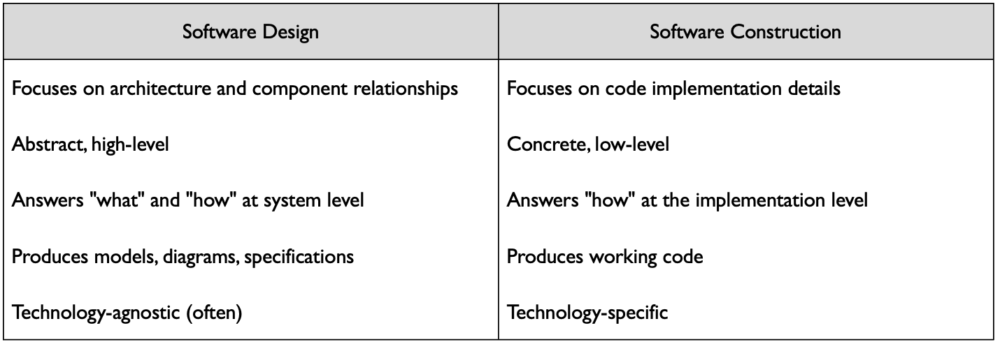

The smoothness of this phase depends on the design phase.
In order to maintain efficiency, the code should be written in the same way by all the developer team, hence the next point of coding standards and conventions.

## Coding Standards

They are rules and guidelines for writing code.

It includes formatting, naming conventions, architectural practices, and documentation.

The goal of these standards is consistency through code, readability, onboarding (helping new developers adapt), quality (prevent errors), efficiency (reduce time spent on formatting), and knowledge sharing (common vocab and patterns).

For example, in Java, it is convention to use CamelCase for class names, camelCase for method and variable names, and ALL_CAPS for constants, with a 100-character line length limit.

In Python, CamelCase for class names, snake_case for functions and variables, with a max line length of 79 characters. Also, avoid global variables and excessive comments.

## Snapshot Diagrams

They represent the internal state of a program at runtime.
We use them to illustrate concepts and share ideas.

### Primitive Values

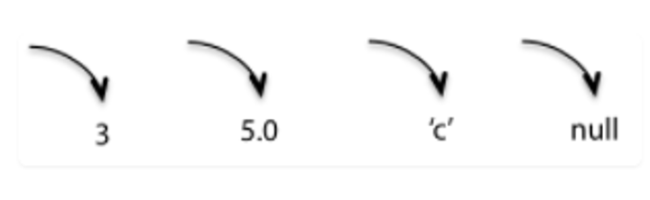

### Object Values

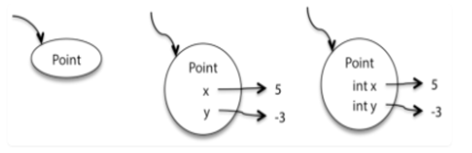

### Immutable and Mutable Values

These diagrams allow us to visualize reassignment and immutable values.
The photo below shows how strings are immutable.

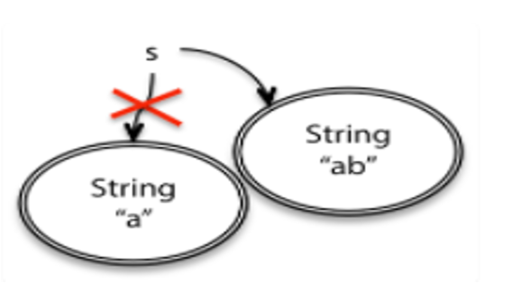

As shown above, immutable objects are denoted in a snapshot diagram by a double border.
A StringBuilder object in Java represents a mutable string to allow for better and more efficient memory management.

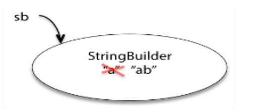

```java
StringBuilder sb = new StringBuilder("a");
sb.append("b");
```

### Immutable References (Constants)

```java
final int n =5;
```

It is denoted by a double arrow.

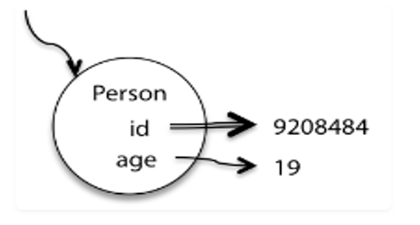

## Specifications

It makes communication easier for anyone using the functions or code components created.

Compare between the 2 photos below and see for yourself how specifications are easier to read than pure code.

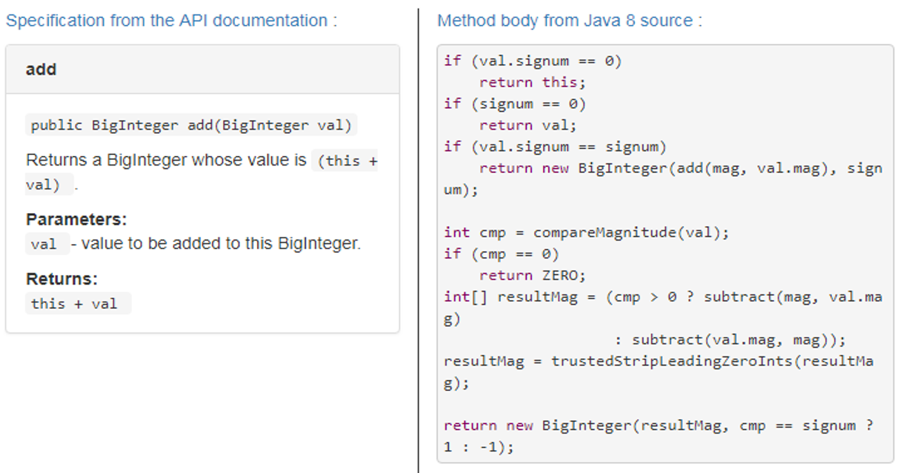

Also, the one who wrote the method could change the implementation as long as it follows the same specification.

The specifications act as a firewall between the client (the one using the code) and the implementor (the one who wrote the code).
This allows the code unit and client code to be **decoupled** or separated, as long as the changes respect the specification.

### Behavioral Equivalence

```java

static int findFirst(int[] arr, int val) {
    for (int i = 0; i < arr.length; i++) {
        if (arr[i] == val) return i;
    }
    return arr.length;
}

static int findLast(int [arr], int val) {
    for (int i = arr.length - 1; i >= 0; i--) {
        if (arr[i] == val) return i;
    }
    return -1;
}
```

Can you substitute one implementation for another?
Not only the code is different, nut also they return different things. When the val is missing, findFirst returns the length and findLast returns -1;
When val appears twice, findFirst returns the lower index and findLast returns the higher.

If clients only use the methods to find a single val within an array, then both implementations are exactly the same.

## Specification Structure

In order to know if methods are behaviorally equivalent, a specification is needed to state exactly how each one behaves.

In our case, the specification could be:

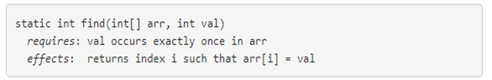

A specification consists of a *requires* keyword indicating a precondition and an *effects* keyword indicating a postcondition.

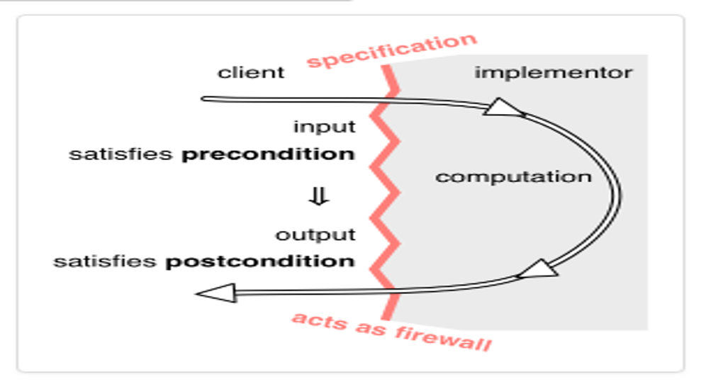

The precondition is an obligation on the client (the caller of the method).
The postcondition is an obligation on the implementer of the method.

If the precondition does NOT hold when the method is called, the implementation is NOT bound by the postcondition. It is free to do anything.

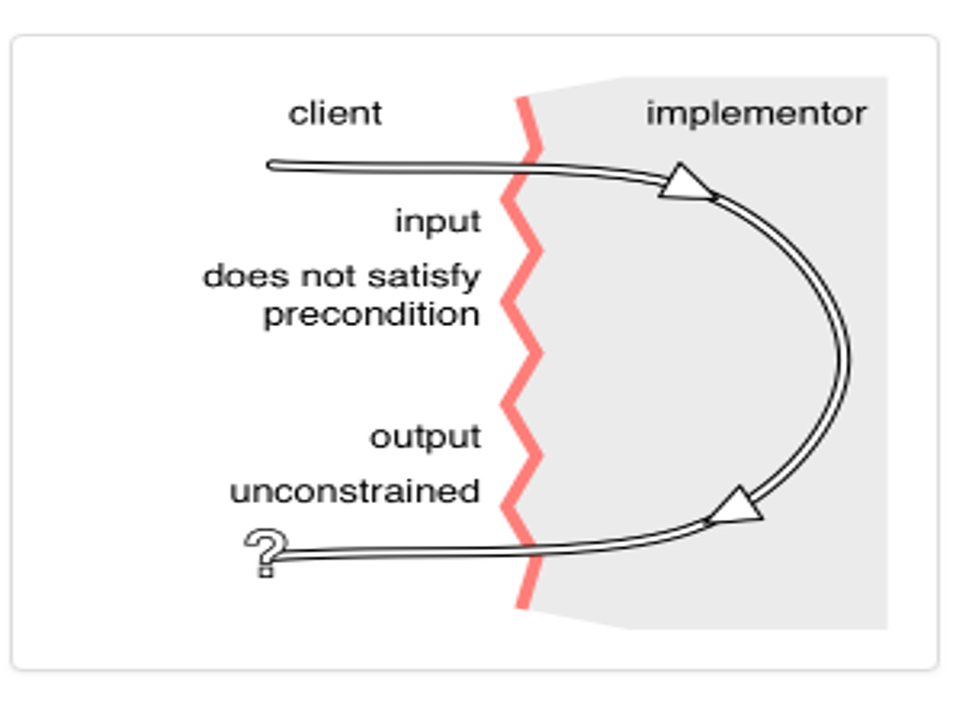

### Java Specifications

Convention: @param for parameters, @return for return, and @throws.
The preconditions are in @param and the postconditions into @return and @throws.

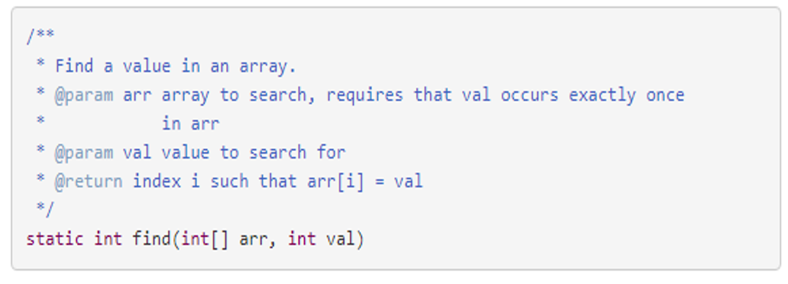

Which is shown as this

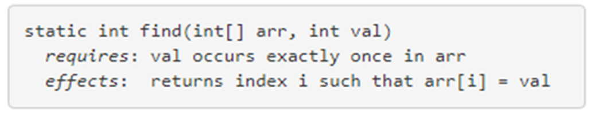

Below are a couple of examples:

### Mutating Methods

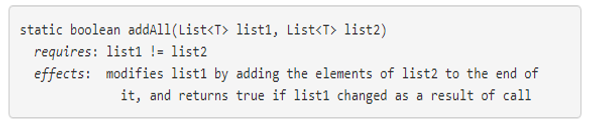

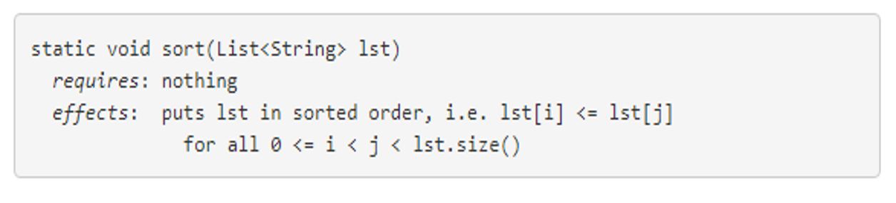

### Non-mutating Method

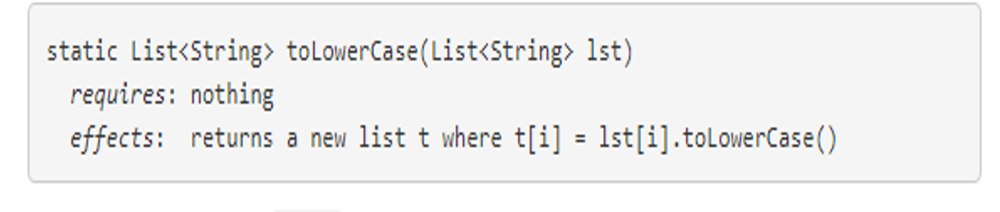