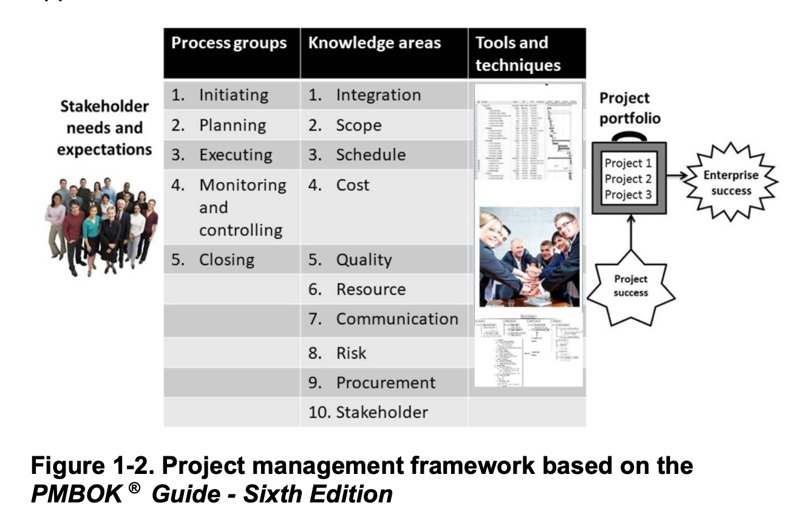

# Chapter 1: An Introduction to Project, Program, & Portfolio Management

## Table of Contents

- [Chapter 1: An Introduction to Project, Program, \& Portfolio Management](#chapter-1-an-introduction-to-project-program--portfolio-management)
  - [Table of Contents](#table-of-contents)
  - [Objectives](#objectives)
  - [Introduction](#introduction)
  - [What is a Project?](#what-is-a-project)
  - [Project Attributes](#project-attributes)
  - [Project Constraints](#project-constraints)
  - [Project Management](#project-management)
  - [Project Management Framework (Sixth Edition)](#project-management-framework-sixth-edition)
    - [Stakeholders](#stakeholders)
    - [Process Groups \& Knowledge Areas](#process-groups--knowledge-areas)
    - [Tools \& Techniques](#tools--techniques)
    - [Project Success](#project-success)
  - [Project Management Framework (Seventh Edition)](#project-management-framework-seventh-edition)
    - [The Principles](#the-principles)
    - [Project Performance Domains](#project-performance-domains)
    - [Tailoring](#tailoring)
    - [Models, Methods, \& Artifacts](#models-methods--artifacts)
  - [Program and Project Portfolio Management](#program-and-project-portfolio-management)
  - [AGILE](#agile)
    - [The mindset](#the-mindset)
    - [Predictive Vs Agile Vs Hybrid](#predictive-vs-agile-vs-hybrid)
    - [Some advice](#some-advice)
  - [The Project Management Profession](#the-project-management-profession)
    - [Suggested Skills](#suggested-skills)
    - [PMI Talent Triangle](#pmi-talent-triangle)
    - [Best Practices](#best-practices)
    - [Certifications](#certifications)
    - [Ethics in Project Management](#ethics-in-project-management)
    - [Career Path](#career-path)
    - [PM Software](#pm-software)
  - [SUMMARY](#summary)

## Objectives

1. Understand the growing need for better project, program, and portfolio management.
2. Explain what a project is, provide examples of projects, list various attributes of projects, and describe project constraints.
3. Define project management and discuss key elements of project management using a process-oriented approach and a principle-based approach.
4. Discuss the relationship between project, program, and portfolio management and their contributions to enterprise success.
5. Understand important agile concepts.
6. Explain the differences between predictive, agile, and hybrid approaches to project management.
7. Describe the project management profession, including the role of project managers and suggested skills, the role of professional
organizations, the importance of certification and ethics, project management careers, and the growth of project and portfolio management
software.

## Introduction

- Agile project management is not only used in software development anymore.
- People nowadays manage projects using predictive (waterfall), agile, or hybrid project approaches.
- Agile organizations respond better to change.
- Basically, this section is all about how project management raises the probability of a project's success and helps keep the work organized.

## What is a Project?

- A temporary endeavour undertaken to create a unique product, service, or result.
- **Operations** is work done to sustain the business.
- Even after its completion, the project might not yield direct results, hence the importance of operations.
- Project management even had a role in ancient mega-projects like the Giza pyramids and Taj Mahal.

## Project Attributes

1. Has a unique purpose
2. Temporary with a definite beginning and end
3. Drives change & enables value creation. It changes the context to a more desired or valued future state.
4. Developed using progressive elaboration or iteratively.
5. Requires resources, often from various areas
6. Should have a primary customer or sponsor. The project sponsor provides direction and funding for the project.
7. Involves uncertainty (because projects are unique)

- **Key Idea**: Project managers work with sponsors, team, and others to define, communicate, and meet project goals.

## Project Constraints

 

- **Triple constraint**: scope, schedule (time), and cost (STC is a nice abbreviation.)
- **Quadruple** adds the quality as a fourth constraint.
- Quality, risk, and resources affect the ability to meet scope, schedule, and cost goals.
- It is more realistic to set a range of goals that allow for uncertainties.
- You must prioritize as well, i.e. not all constraints have the same importance. You might have to adjust other constraints to meet the most important one.
- Meeting these constraints should not make you lose sight of customer satisfaction.

## Project Management

- The application of knowledge, skills, tools, & techniques to project activities to meet the project requirements.
- Strive to meet constraints while meeting the needs & expectations of the people involved in or affected by project activities.

## Project Management Framework (Sixth Edition)

- Key Elements:
  - **Stakeholders**
  - **Process Groups**
    1. *Initiating*
    2. *Planning*
    3. *Executing*
    4. *Monitoring & Controlling*
    5. *Closing*
  - **Knowledge Areas**
    1. *Integration* (coordinates the work of other areas)
    2. *Scope* (working with all appropriate stakeholders define, gain written agreement for, and manage all the work required to complete the project successfully)
    3. *Schedule* (estimating how long will it take to complete the work)
    4. *Cost* (preparing & managing budget)
    5. *Quality* (ensuring project will satisfy the stated or implied needs for which it was undertaken)
    6. *Resource* (effectively use resources, whether people or physical)
    7. *Communication* (generating,collecting, and managing project info)
    8. *Risk* (identify, analyze, and respond to risks)
    9. *Procurement* (acquiring goods & services for a project from outside)
    10. *Stakeholder* (identifying them, understanding their needs & expectations, and engaging them appropriately throughout the project)
  - **Tools & Techniques**
  - **Project Success**
  - **Contribution of portfolio of projects to enterprise success**
  - In the new version, it became a **principle-oriented** approach rather than the process-oriented one above.

### Stakeholders

- They are the people involved in or affected by project activities:
  - project sponsor (paying)
  - project team
  - project manager
  - support staff
  - customers
  - users
  - suppliers
  - opponents
- Their needs & expectations are crucial in the beginning and throughout the life of a project.

### Process Groups & Knowledge Areas

- There are 5 process groups and 10 knowledge areas, all of them are above.
- The knowledge areas are the key skills a project manager must develop.
- I wrote a brief description of each one above.
- Regarding process groups, they will be mentioned in Chapter 3.

### Tools & Techniques

- They assist project managers and their teams in carrying out work in all ten knowledge areas.
- Predictive (or waterfall) may require project charters, scope statements, Gantt charts, kick-off meetings, progress reports, and so on.
- Agile often need product roadmaps, backlogs, burndown charts, retrospectives, etc.

### Project Success

- The bottom line is we need to define success objectively rather than subjectively.
- Below are some of accepted measures:
  - Value (the worth, importance, or usefulness of sth. could be tricky to measure)
  - Meeting the triple constraint ([STC](#stc))
  - Satisfying the customer/sponsor. (one method is **net promoter score**)

## Project Management Framework (Seventh Edition)

- A principle-centered approach that is structured around eight project performance domains and 2 other sections
  1. stakeholders
  2. team
  3. development approach & life cycle (discussed in Ch 3)
  4. planning (Ch 4-6)
  5. project work (Ch 7)
  6. delivery (of scope and quality)
  7. measurement (Ch 8 - monitor and control)
  8. uncertainty
  9. tailoring
  10. models, methods, & artifacts

### The Principles

- They serve as foundational guidelines.
- There are 12, shown above in the figure.

### Project Performance Domains

- groups of related activities that are critical for effective delivery of project outcomes
- they work together to achieve desired outcomes
- I included some descriptions above for the ones that needed clarification.

### Tailoring

- Customizing the project management processes and frameworks for your current environment and the work at hand.
- Factors to consider include the size of the project, complexity, expected duration, industry, organizational culture, and project management maturity.
- 4 step approach:
  1. Select an initial approach.
  2. Tailor for organization.
  3. Tailor for the project.
  4. Implement ongoing improvement.

### Models, Methods, & Artifacts

- **Model**: a thinking strategy to describe a process, framework, or phenomenon. A process is a sequence of steps to do something.
- **Method**: how to achieve an outcome, output, result, or project deliverable.
- **Artifact**: can be a template document or project deliverable. (business cases, logs and registers, plans, hierarchy charts, reports, and contracts)

## Program and Project Portfolio Management

- A **program** is a group of related projects or smaller programs that are managed in a coordinated matter to obtain a higher-level benefit.
- A **megaproject** is a very large project that typically costs over $1 billion, affects over a million people, and lasts several years. (e.g., Riyadh Metro)
- As a side note, a product manager focuses on product creation rather than a particular project.
- It is just nice to combine several related projects together in a program. It saves costs and increases the progress speed.
- A **program manager** provides leadership and direction for the project managers, coordinate efforts of project-related activities, and are responsible for success of products and processes produced by those projects.
- A **portfolio** is defined as a collection of projects, programs, smaller portfolios, and operations managed as a group to achieve strategic objectives.
- The main distinction is a focus on tactical (short-term & specific) vs strategic goals (long-term). Project and program management address tactical goals, whereas portfolio addresses strategic goals.
- Usually, all projects and programs working to achieve one strategic goal are grouped under one portfolio.

## AGILE

- A term used to describe a mindset of values and principles as set forth in the Agile Manifesto, which revolves around the ability to create and respond to change.
- A group of 17 people (called the Agile Alliance) developed the Manifesto.
- It is not necessarily a fixed way of development, but rather it is a mindset.
- We value
  - individuals & interactions over processes & tools
  - working software over comprehensive documentation (Demos win debates)
  - customer collaboration over contract negotiation
  - responding to change over following a plan
- **The Manifesto**
   1. Highest priority is to satisfy customer through early & continuous delivery of valuable software.
   2. Welcome changing requirements, even late in development. Agile processes harness change for the customer's competitive advantage.
   3. Deliver working software frequently preferably in a short time frame (weeks).
   4. Business people & developers must work together daily throughout the project.
   5. Build projects around motivated individuals.
   6. The most efficient & effective method of conveying info to and within a dev team is face-to-face communication.
   7. Working software is the primary measure of progress.
   8. Agile processes promote sustainable development. The sponsors, developers, & users should be able to maintain a constant pace indefinitely.
   9. Continuous attention to technical excellence and good design enhances agility.
   10. Simplicity -- the art of maximizing the amount of work not done -- is essential.
   11. The best architectures, requirements, & designs emerge from self-organizing teams.
   12. At regular intervals, the team reflects on how to become more effective, then tunes and adjusts its behavior accordingly.

### The mindset

- *Bureaucratic Mindset*: top-down hierarchy with many layers & divisions, the goal is to make money for the firm & maximize shareholder value, individuals report to bosses
- *Agile Mindset*: network of teams focused on the goal of delivering value in a short time.

### Predictive Vs Agile Vs Hybrid

- *Agile Project Management*, or adaptive, does not have a well-defined scope upfront with incremental releases and where changes are expected. Variable scope and fixed time & cost.
- *Predictive Project Management*, or waterfall, or traditional, is where most of project planning is done upfront and there is a final product, service, or result delivered at the end. Change is constrained, costs & risks are controlled. (remodeling a kitchen on a fairly fixed budget)
- *Hybrid Project Management* is a mixture or combinations of predictive and agile. This is the current leading approach.

### Some advice

- Let people work together to figure out the best way to get work done.

## The Project Management Profession

### Suggested Skills

1. All ten knowledge areas & all eight performance domains
2. The Application Area (industry, domain, market, etc.)
3. The Project Environment (politics, culture, change management, etc.)
4. General Business (financial management, strategic planning, etc.)
5. Human Relations (leadership, motivation, communication, etc.)

### PMI Talent Triangle

1. *Technical Project Management Skills*: knowledge areas, performance domains, tools & techniques, and different management approaches.
2. *Strategic & Business Management Skills*: strategic planning (Ch 2), ...etc.
3. *Leadership Skills*: Leader focuses on long-term, whereas manager deals with day-to-day details. Managers do things right, and leaders do the right things. Leaders determine the vision, and managers achieve the vision. Project managers are usually both leaders and managers.

### Best Practices

1. Make sure your projects are driven by your strategy. Demonstrate how each project fits your business strategy, and screen out unwanted projects as soon as possible.
2. Engage your stakeholders. Ignoring stakeholders often leads to project failure. Be sure to engage stakeholders at all stages of a project and encourage teamwork and commitment at all times. Use leadership and open communication to make things happen.

### Certifications

- Discussed in Ch 10 in more details.

### Ethics in Project Management

- What guides us and what shapes what we view as right or wrong

### Career Path

- There are a lot of career advantages if you pursue project management even if you decide not to continue later.

### PM Software

- Some tools are generic like Excel and Google Docs.
- Microsoft Project
- Atlassian Jira
- Azure DevOps
- VersionOne
- MindView

Remember **A fool with a tool is still just a fool.**

## SUMMARY

- Renewed interest in project management today as number of projects grow.
- Failing to meet the triple constraints (scope, time, & cost) could be costly.
- A project is a temporary endeavour undertaken to create a unique product or service.
- PM is the application of knowledge, skills, tools, & techniques to project activities to meet project requirements.
- There are 2 frameworks for PM, one is based on 5 process groups and 10 knowledge areas, while the other is based on 12 principles and 8 project performance domains.
- Using an agile or hybrid approach to project management is the meta due to its ability to deliver working software and coping with changing requirements.
- A program is a group of related projects, a portfolio is a group of projects & programs, and a megaproject is one that is huge in cost and effect.
- Portfolio management focuses on strategic goals, while project & product focus on tactical ones.
- The profession continues to grow and requires a lot of skill sets and knowledge of tools to succeed in.

