# Chapter 3: Project Life Cycles and Initiating Projects

## Table of Contents

- [Chapter 3: Project Life Cycles and Initiating Projects](#chapter-3-project-life-cycles-and-initiating-projects)
  - [Table of Contents](#table-of-contents)
  - [Objectives](#objectives)
  - [Development Approaches and Project Life Cycles](#development-approaches-and-project-life-cycles)
    - [Development Approaches](#development-approaches)
    - [Project Life Cycles](#project-life-cycles)
    - [Product Life Cycles](#product-life-cycles)
  - [Project Management Process Groups](#project-management-process-groups)
    - [Mapping the Process Groups to Knowledge Areas](#mapping-the-process-groups-to-knowledge-areas)
  - [The Importance of Top Management Commitment](#the-importance-of-top-management-commitment)
  - [The Need for Organizational Standards](#the-need-for-organizational-standards)
  - [Project Management Offices](#project-management-offices)
  - [Pre-initiating And Initiating Process](#pre-initiating-and-initiating-process)
    - [Preparing a business case](#preparing-a-business-case)
      - [Contents](#contents)
    - [Identifying Stakeholders](#identifying-stakeholders)
      - [The Stakeholder Register](#the-stakeholder-register)
      - [The Stakeholder Analysis](#the-stakeholder-analysis)
    - [Creating a Charter and Assumptions Log](#creating-a-charter-and-assumptions-log)
      - [Contents of Charter](#contents-of-charter)
      - [Contents of Assumption Log](#contents-of-assumption-log)
    - [Holding a Kick-Off Meeting](#holding-a-kick-off-meeting)
      - [The Agenda Contents](#the-agenda-contents)
  - [Pre-initiating and Initiating Process](#pre-initiating-and-initiating-process-1)
    - [Scrum Framework](#scrum-framework)
    - [Identifying Key Stakeholders](#identifying-key-stakeholders)
    - [Creating a Vision Statement](#creating-a-vision-statement)
    - [Creating a Product Strategy and Product Roadmap](#creating-a-product-strategy-and-product-roadmap)
    - [Project Charter and Kick-Off Meeting](#project-charter-and-kick-off-meeting)
    - [Initial Product Backlog and Estimating Size](#initial-product-backlog-and-estimating-size)
    - [Creating a High-Level Product Release Plan](#creating-a-high-level-product-release-plan)
  - [Summary](#summary)

## Objectives

- Discuss the importance of establishing a development approach, cadence, and project life cycle to optimize project outcomes.
- Describe the five project management process groups, and map the process groups to knowledge areas for predictive project management.
- Understand the importance of top management commitment, organizational standards, and Project Management Offices.
- Summarize the initiating process for a predictive project management approach, be able to prepare a business case, perform a stakeholder analysis, create a project charter and assumption log, and describe the importance of holding a good project kick-off meeting.
- Understand the difference between initiating a predictive project and an agile or hybrid project, describe the Scrum framework, and be able to create a product vision statement, product roadmap, initial product backlog, and release plan.

## Development Approaches and Project Life Cycles

### Development Approaches

Before initiating a project, it is important to determine what development approach we will use.

**Development Approach**: a method used to create and evolve a product, service, or result during the project life cycle, such as predictive, iterative, incremental, adaptive (agile), or hybrid.

An important aspect of dev approaches is **cadence**, which is a rhythm of activities conducted throughout the project. Projects could have single deliveries, multiple deliveries, periodic deliveries, or continuous delivery.

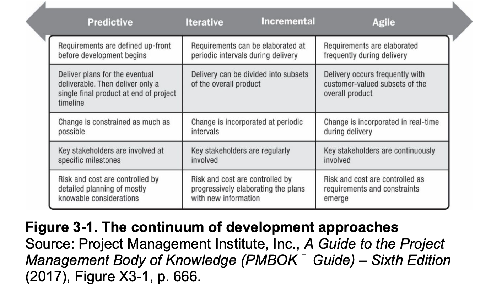

**Iterative**: feedback after every iteration
**Incremental**: completing small sections and building on top of them

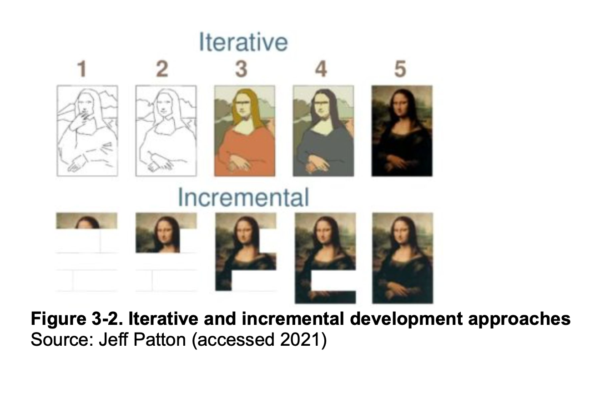

### Project Life Cycles

A series of phases that a project passes through from its start to its completion

A **project phase** is a collection of logically related project activities that culminates in the completion of one or more deliverables.

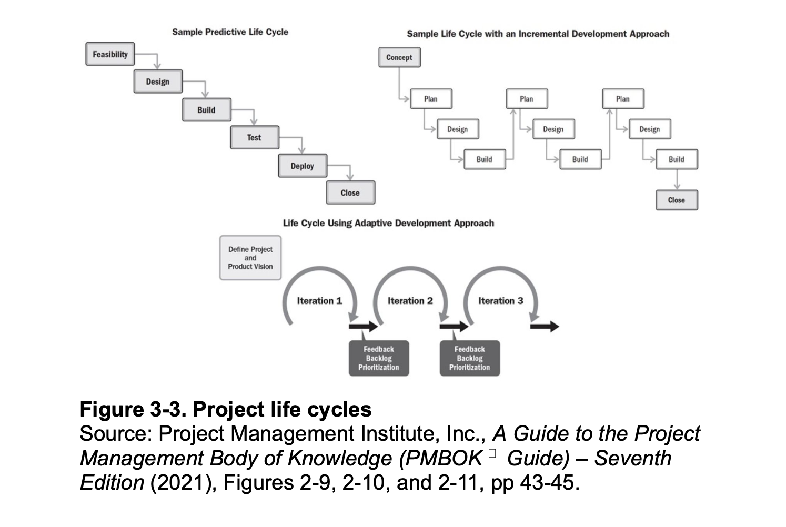

### Product Life Cycles

Products often involve programs and projects.

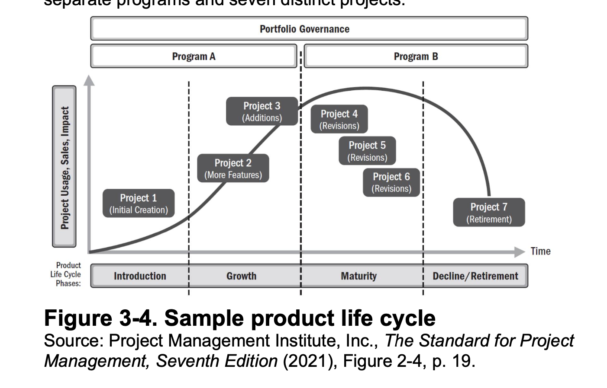

## Project Management Process Groups

Recall that a predictive approach has 10 project management knowledge areas:

1. Project integration
2. Scope
3. Schedule
4. Cost
5. Quality
6. Human Resource
7. Communications
8. Risk
9. Procurement
10. Stakeholder Management

5 process groups

1. Initiating (define and authorize a new project or phase/ project charter and kick-off meeting) Ch 3
2. Planning (devising and maintaining a workable scheme) Ch 4-6
3. Executing (coordinating people and resources to carry out plans and produce deliverables) Ch 7
4. Monitoring & Controlling (measure progress toward achieving project goals, monitor variance from plans, and take corrective actions) Ch 8
5. Closing (formalizing acceptance of the project or phase) Ch 9

A **process** is a series of actions directed toward a particular result.

These are NOT isolated events. The level of activity and length of each group varies for every project.

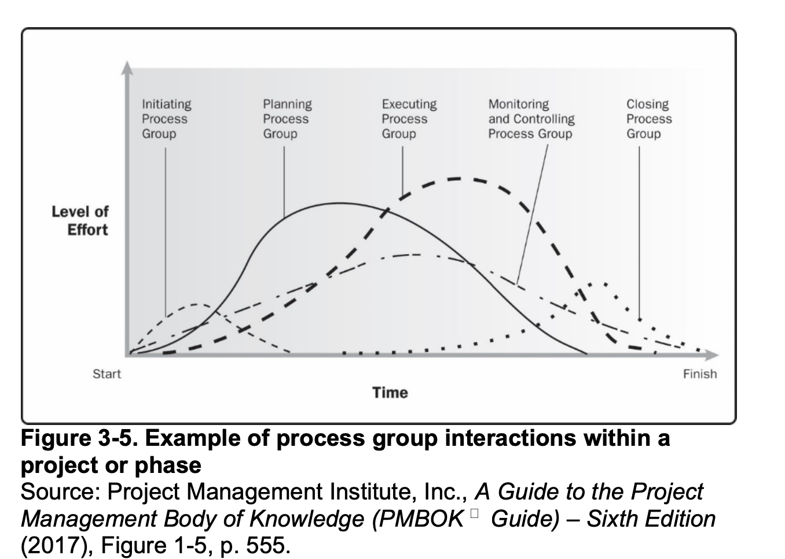

### Mapping the Process Groups to Knowledge Areas

There are 49 processes.

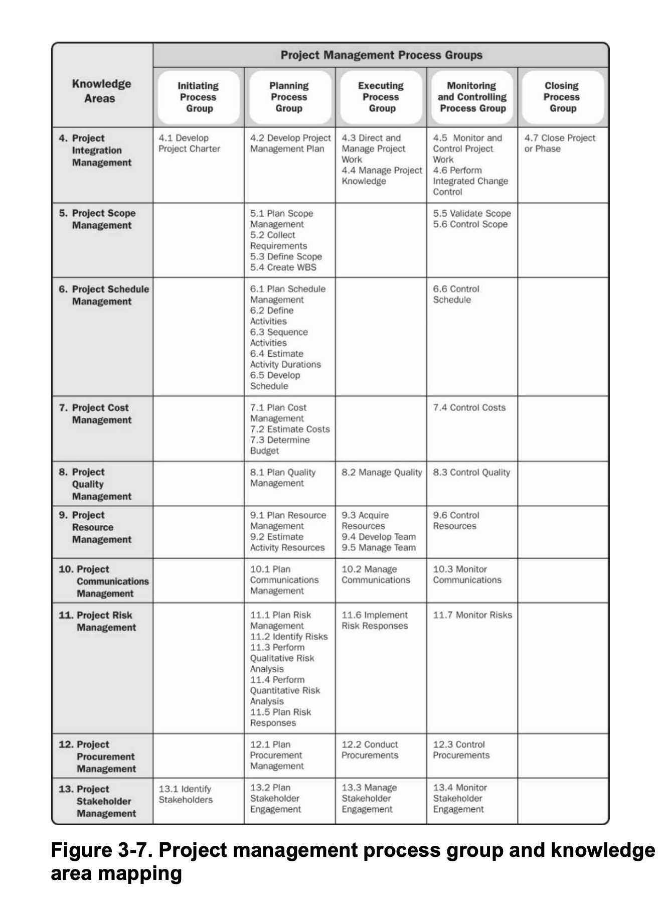

The main outputs of initiation include a stakeholder register, project charter, an assumptions log, and a kick-off meeting.

A **template** is a file with preset format that servs as a starting point for creating various documents.

## The Importance of Top Management Commitment

Some projects have a **champion**, a senior manager who acts a key proponent.

The top managers need to commit for the following reasons:

1. Having adequate resources
2. Unique project needs in a timely manner
3. Cooperation from people in the organization
4. Mentor project managers to improve their leadership skills

## The Need for Organizational Standards

Help new project managers get in the flow. It could be as easy as just providing templates and guidelines.

## Project Management Offices

An organizational entity created to assist project managers in achieving project goals.

Basically, the office helps an organization care more and dedicate more time and resources to project management.

Possible goals:

1. Collect, organize, and integrate project data for entire organization
2. Research, develop and share best project management practices
3. Develop and maintain templates, tools, standards, and methodologies
4. Develop and provide a formal career path for project managers
5. Provide project management consulting services
6. Provide a structure to house project managers while they are acting in those roles or between projects

3 key contributions that support value delivery:

1. Fostering delivery and outcome-oriented capabilities
2. Keeping the "big picture" perspective
3. Continuous improvement, knowledge transfer, and change management

## Pre-initiating And Initiating Process

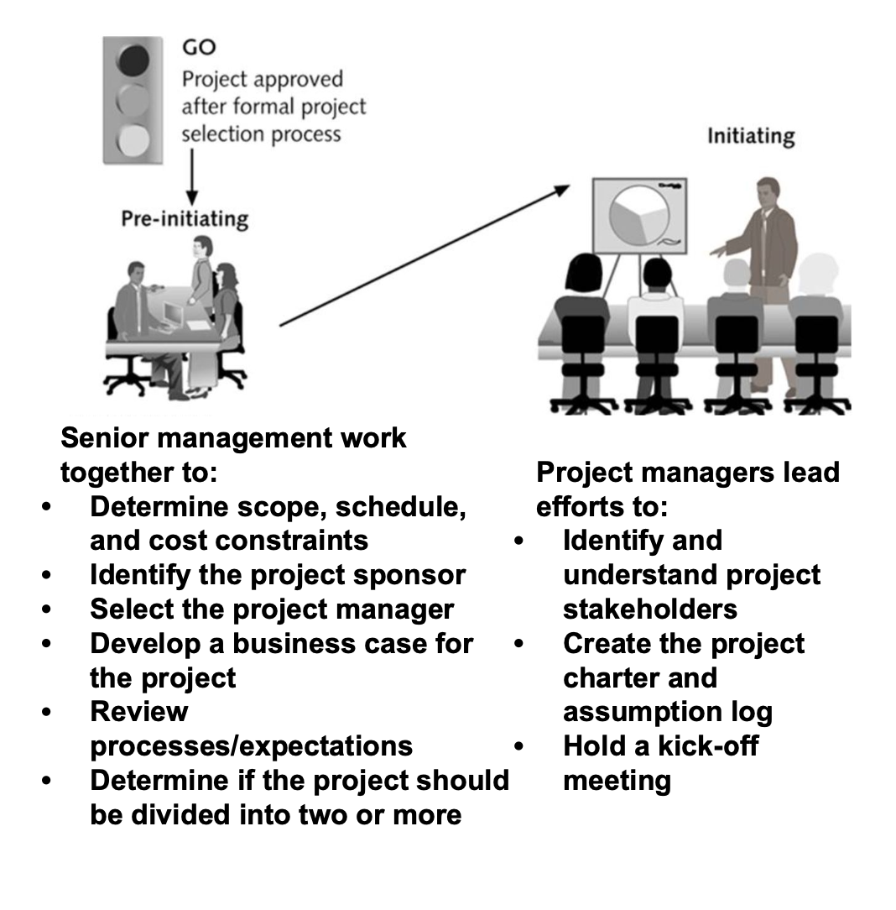

### Preparing a business case

A document that provides financial justification for investing in a project.

Not all projects need business cases. Some projects that cost less than 50K might not require a business case, while others estimated to cost more than a million might need an extensive business case signed off by the Chief Financial Officer.

Needs assessment / benefits management

#### Contents

- Intro/Background
- Business Objective
- Current Situation and Problem/Opportunity Statement
- Critical Assumptions and Constraints
- Analysis of Options and Recommendations
- Preliminary Project Reqs
- Budget Estimate and Financial Analysis
- Schedule Estimate
- Potential Risks
- Exhibits

### Identifying Stakeholders

They are the people involved in or affected by project activities.

They could be internal or external. The best way to identify them is by asking around.

The main output of this stage is a stakeholder register, and a key technique for understanding stakeholders is a stakeholder analysis.

#### The Stakeholder Register

A register includes details about project stakeholders and contains the following:

1. Identification info
2. Assessment info (requirements and expectations)
3. Stakeholder classification (external/internal, supporter/resistor)

No sensitive info since this document is available to other people.

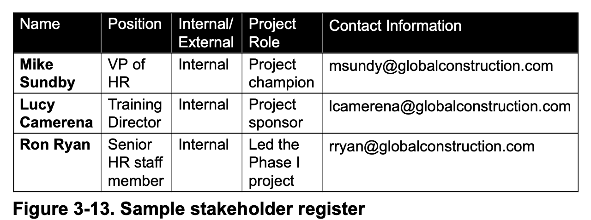

#### The Stakeholder Analysis

The analysis is to determine which stakeholders' interests to focus on and how to increase their support. For example, you can create a power/interest grid.

It is also important to measure their engagement level:

- unaware
- resistant (aware yet resistant)
- neutral
- supportive
- leading (engaged in helping it succeed)

Then, formulate a stakeholder engagement plan.

### Creating a Charter and Assumptions Log

Charter is a document that formally recognizes the existence of a project and summarize its objectives and management. It authorizes the PM to use org resources.

Inputs: business docs (bus case, agreements, enterprise env factors, org process assets)

Enterprise evn factors: conditions not under immediate control of project team that influence the project.

Org process assets: plans, processes, policies, procedures, and knowledge bases such as templates.

A crucial part is sign-off sections, where key stakeholders sign the doc to acknowledge agreement.

#### Contents of Charter

- Project title and authorization date
- PM's name and contact info
- summary schedule
- summary of estimated cost and budget allocation
- brief desc of project objectives
- Success criteria
- summary of planned approach
- roles and responsibilities matrix
- sign-off section
- comments section

Usually short

#### Contents of Assumption Log

Document used to record and track assumptions and constraints throughout the project life cycle.

- ID
- Description
- Category
- Owner
- Due Date
- Status
- Actions

### Holding a Kick-Off Meeting

Stakeholders meet each other, review project goals, and discuss future plans.

Physically is better or virtually with video and mic.

#### The Agenda Contents

- meeting objective
- agenda (topics of discussion)
- section for documenting action items
- section to document date and time of next meeting

## Pre-initiating and Initiating Process

### Scrum Framework

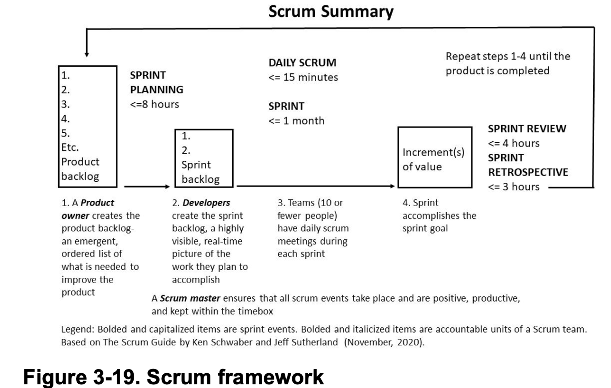

Transparency, inspection, and adaptation

5 values: commitment, focus, openness, respect, and courage

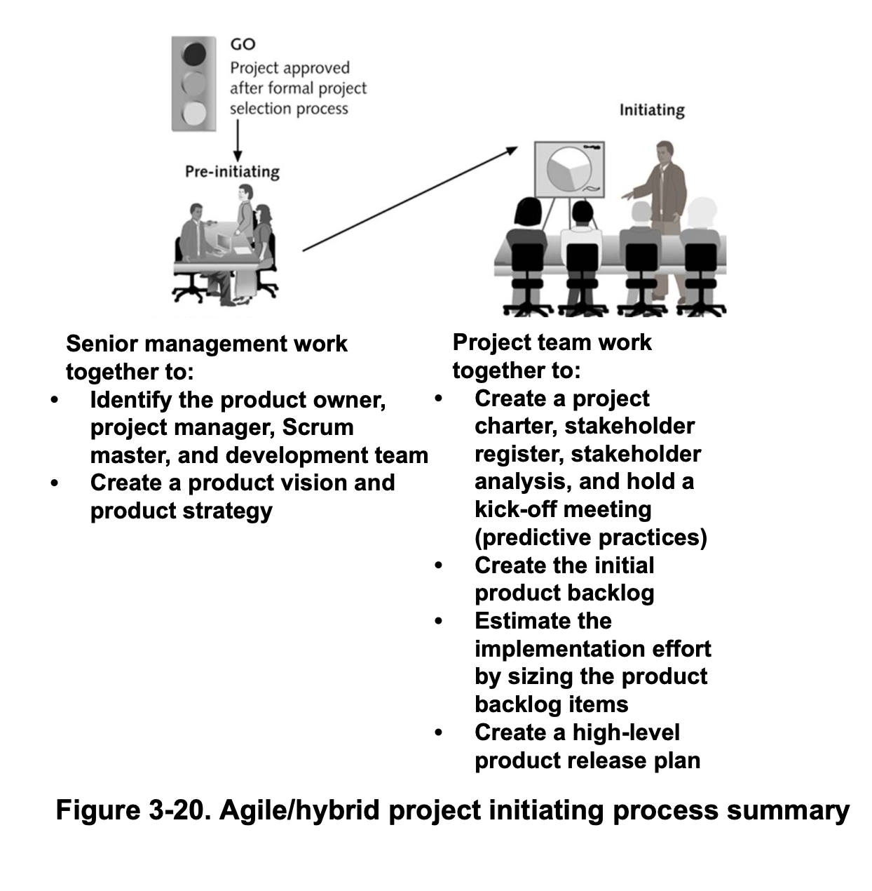

### Identifying Key Stakeholders

- Product Owner
- Scrum master
- Dev Team

### Creating a Vision Statement

Product Vision (desired future state)

### Creating a Product Strategy and Product Roadmap

Product Strategy (high-level plan describes what or hopes to accomplish and how)

Product Roadmap: depicts the strategy

### Project Charter and Kick-Off Meeting

### Initial Product Backlog and Estimating Size

user story: a description of what customer or user would want from product or solution.

### Creating a High-Level Product Release Plan

A tactical doc that spans only a few months and is used internally for dev teams.

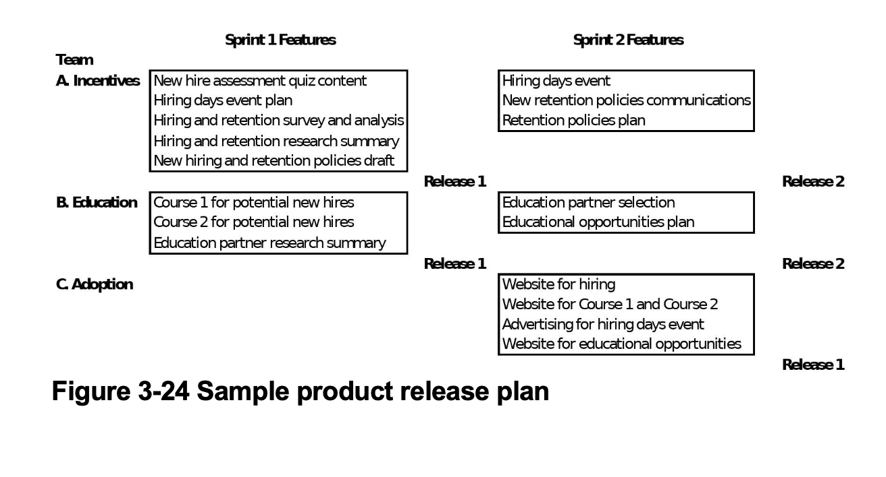

## Summary

Before initiating projects, it is important to determine the
development approach and consider the project and product life
cycle. In addition to how well requirements are defined, other factors
that differ with each approach are how often products are delivered
(the cadence), how change is incorporated, how much key
stakeholders are involved, and how risk and cost are controlled.

It is also important to understand the importance of top
management commitment, organizational standards, and Project
Management Offices to helping projects succeed.
The five project management process groups are initiating,
planning, executing, monitoring and controlling, and closing. These
process groups occur at varying levels of intensity throughout every
phase of a project, and each process produces specific outputs.
Mapping the main processes of each project management process
group into the ten project management knowledge areas provides a
big picture of what activities are involved in predictive project
management.

Global Construction’s Just-In-Time Training project
demonstrates the process of initiating a project using a predictive
approach to project management. After a project is approved, senior
managers often meet to perform several pre-initiating activities, and
then the team works together to perform the following as part of
initiating:
    Identifying stakeholders
    Creating the project charter
    Creating an assumptions log
    Holding a kick-off meeting

Global Construction’s Human Capital project demonstrates
the process of initiating a project using a hybrid approach to project
management. After a project is approved, senior managers often
meet to perform several pre-initiating activities, and then the team
works together to perform the following as part of initiating:
    Creating a project charter, stakeholder register, stakeholder
    analysis, and holding a kick-off meeting (as done in a
    predictive approach)

    Creating the initial product backlog
    Estimating the implementation effort by sizing the product
    backlog items

    Creating a high-level product release plan

Descriptions of how each of these activities were accomplished and
samples of related outputs are described in the chapter.