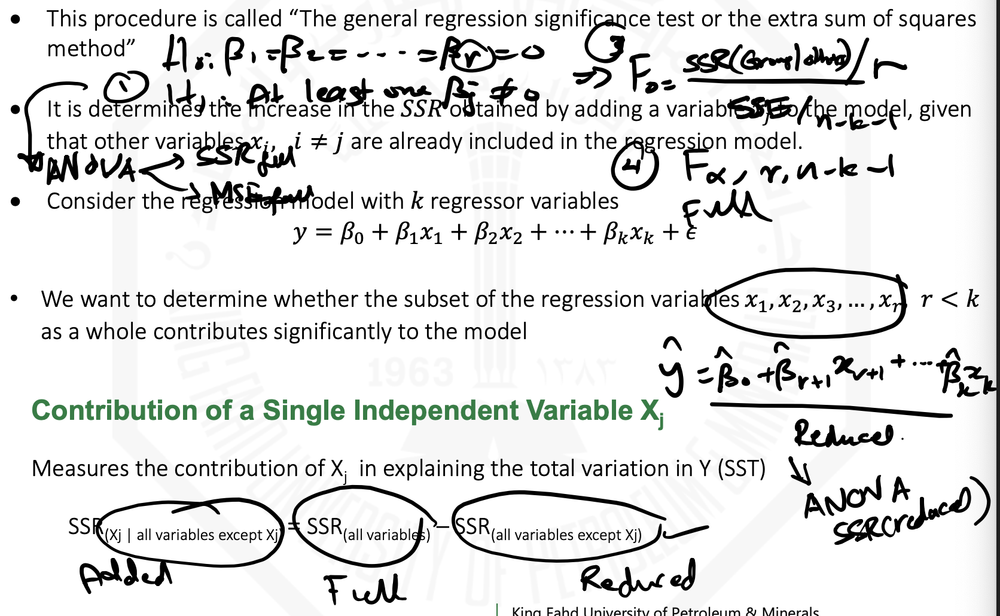
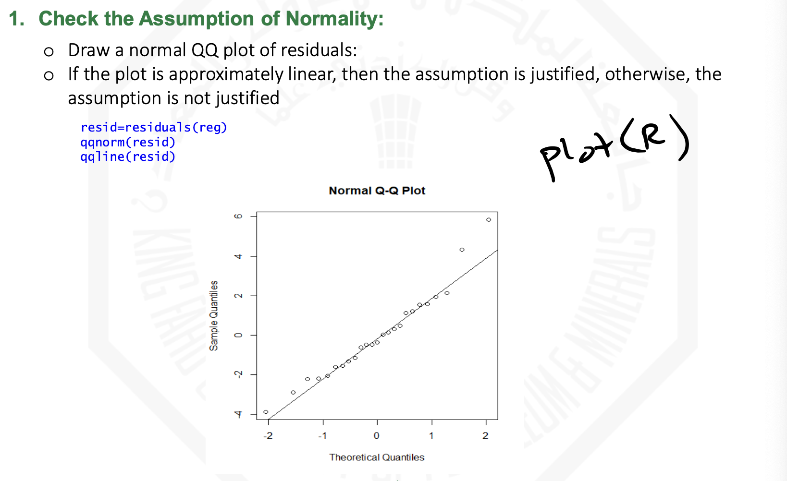

# Chapter 12: Multiple Regression

## Table of Contents

- [Chapter 12: Multiple Regression](#chapter-12-multiple-regression)
  - [Table of Contents](#table-of-contents)
  - [Objectives](#objectives)
  - [12.1: Developing a Multiple Regression Model](#121-developing-a-multiple-regression-model)
    - [Multiple Regression Model](#multiple-regression-model)
    - [Assumptions of Regression](#assumptions-of-regression)
    - [The Model Building](#the-model-building)
    - [The Correlation Matrix](#the-correlation-matrix)
    - [R2 and Adjusted R2 and test of overall significance (F test)](#r2-and-adjusted-r2-and-test-of-overall-significance-f-test)
  - [12.2: Inferences Concerning the Population Regression](#122-inferences-concerning-the-population-regression)
    - [Testing each regressor individually](#testing-each-regressor-individually)
    - [Regression Analysis for Description](#regression-analysis-for-description)
    - [Testing Portions of Multiple Regression Model](#testing-portions-of-multiple-regression-model)
      - [The Partial F Test](#the-partial-f-test)
  - [12.3 \& 12.4: Confidence Intervals and Prediction of New Observation](#123--124-confidence-intervals-and-prediction-of-new-observation)
  - [12.5: Model Adequacy Checking](#125-model-adequacy-checking)

## Objectives

- How to develop a multiple regression model
- How to interpret the regression coefficients
- How to determine which independent variables to include in the regression model
- How to determine which independent variables are more important in predicting a dependent variable
- How to measure the correlation among the independent variables

## 12.1: Developing a Multiple Regression Model

### Multiple Regression Model

### Assumptions of Regression

### The Model Building

### The Correlation Matrix

Same ideas for the single linear regression but more generalized.

### R2 and Adjusted R2 and test of overall significance (F test)

## 12.2: Inferences Concerning the Population Regression

### Testing each regressor individually

### Regression Analysis for Description

### Testing Portions of Multiple Regression Model

#### The Partial F Test

## 12.3 & 12.4: Confidence Intervals and Prediction of New Observation

## 12.5: Model Adequacy Checking

