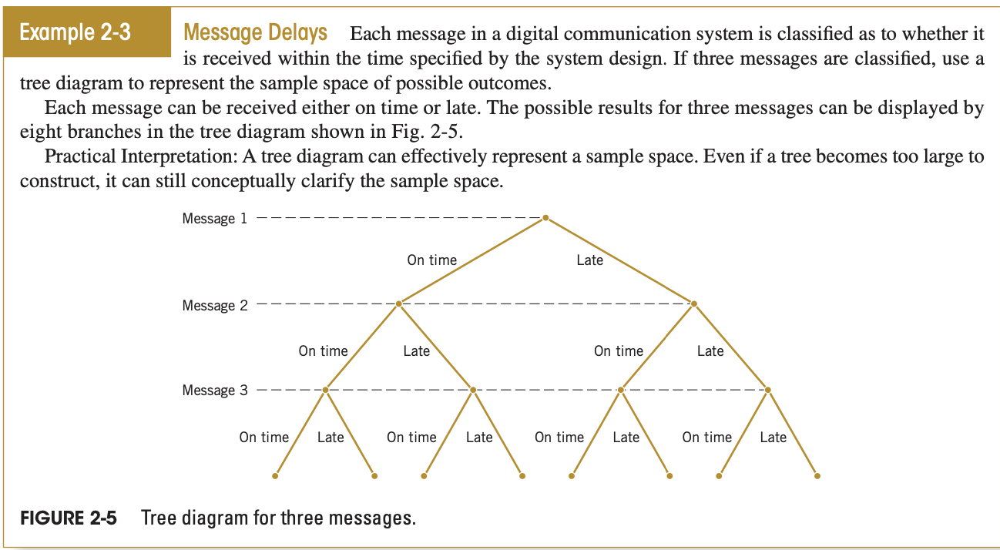
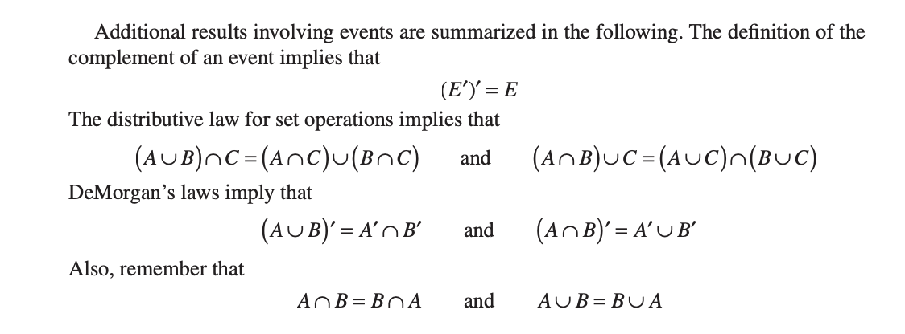

# Chapter 2: Probability

## Table of Contents

- [Chapter 2: Probability](#chapter-2-probability)
  - [Table of Contents](#table-of-contents)
  - [Objectives](#objectives)
  - [2.1 Sample Spaces and Events](#21-sample-spaces-and-events)
    - [Sample Spaces](#sample-spaces)
    - [Events](#events)
      - [Event Combinations](#event-combinations)
      - [Concepts](#concepts)
      - [Some properties](#some-properties)
      - [Assessing Probabilities](#assessing-probabilities)
  - [2.2 - 2.6 Axioms of Probability \& General Rules](#22---26-axioms-of-probability--general-rules)
  - [2.7 Bayes' Theorem](#27-bayes-theorem)

## Objectives

1. Understand and describe sample spaces and events for random experiments with graphs, tables, lists, or tree diagrams.
2. Interpret probabilities and use the probabilities of outcomes to calculate probabilities of events in discrete sample spaces.
3. Use permutations and combinations to count the number of outcomes in both an event and the sample space.
4. Calculate the probabilities of joint events such as unions and intersections from the probabilities of individual events.
5. Interpret and calculate conditional probabilities of events.
6. Determine the independence of events and use independence to calculate probabilities.
7. Use Bayes’ theorem to calculate conditional probabilities.
8. Understand random variables.

## 2.1 Sample Spaces and Events

- **Probability**: the chance or likelihood that an uncertain event will occur (always between 0 and 1)
- Probability of 0 means the event is impossible to occur, while 1 means the event is certain to occur.
- **Random Experiment**: a process of obtaining outcomes for uncertain events, might lead to different results even though it is repeated in exactly the same way every time (measuring the current in a thin copper wire).
- Our goal is to understand, quantify, model the types of variations (randomness) that we encounter while doing an experiment. We then can make informed judgments from the results that are not invalidated by the variation.
- **Sample Space**: the set of all possible outcomes. ($S$ or $\omega$)
- **Elementary Events** OR **Sample Points** are the individual elements in the sample space.
- **Events** are possible outcomes from simple experiments that are a subset of the sample space.
- **Joint Events** are events that have two or more characteristics.

### Sample Spaces

- In general, there are 2 types of sample spaces:
  - Discrete sample space: 
    - the values are countable even if infinite
    - e.g.: number of sand grains, $S = \{HH, HT, TH, TT\}$
  - Continuous sample space:
    - the values are uncountable (interval)
    - e.g.: $S = \{x | x <= 4 \}$
- You can represent a sample space graphically as a tree diagram.

### Events

- A subset of the sample space of a random experiment

#### Event Combinations

1. Union
   - all outcomes in one event OR the other ($A \cup B$)
2. Intersection
   - all outcomes in one event AND the other ($A \cap B$)
3. Complement
   - the set of outcomes in sample space that are NOT in event ($A^c$, $A'$, $\bar{A}$)

#### Concepts

1. Mutually Exclusive Events
   - cannot occur together ($A \cap B = \phi$) or ($P(A \cap B) = 0$)
2. Collectively Exhaustive Events
   - contain the whole sample space ($A \cup B = \omega$) or ($P(A \cup B) = 1$)
3. Independent and Dependent Events
   - independent: occurrence of one does not affect the other
   - dependent: occurrence of one affects the other

#### Some properties

#### Assessing Probabilities

There are three methods:

   1. Priori (Classical Probability)
      - The probability of an event $A$ is the sum of the probabilities of its individual outcomes.
      - It is a general rule that applies in all cases.
   2. Empirical Probability (Relative Frequency)
      - Given that the events in the sample space are equally likely, the probability of a sample point is $\frac{1}{n}$ where $n$ is the number of outcomes.
      - The probability of an event with $k$ possibilities is $\frac{k}{n}$
   3. Subjective Probability
      - Based on an individual's opinion, usually experts.
      - usually considered, when no other options are provided.

## 2.2 - 2.6 Axioms of Probability & General Rules

In this chapter, we introduce probability for discrete sample spaces.

1. Rules for Possible Values & Sum

   a. **Axiom 1** Individual Values:
      $0 <= P(e_i) <= 1$, for any event $e_i$
   b. **Axiom 2** Sum of All
      $\sum_{i=1}^{k} P(e_i) = 1$, $k$ is number of elementary events and $e_i$ is $i^{th}$ elementary event.

2. Addition Rules for Elementary Events

   If $A = {e_1, e_2, \ldots, e_m}$, then $P(A) = P(e_1) + P(e_2) + \ldots + P(e_m)$

3. Complement Rule

   $P(\bar{A}) = 1 - P(A)$

4. Addition Rule for Two Events

   $P(A \cup B) = P(A) + P(B) - P(A \cap B)$

   Note that in case of mutually exclusive, the intersection part will be ZERO.

5. De Morgan's Law

   $P(A' \cap B') = P(A \cup B)' = 1 - P(A \cup B)$
   $P(A' \cup B') = P(A \cap B)' = 1 - P(A \cap B)$

6. Difference Rules

   $P(A \cap B') = P(A) - P(A \cap B)$
   $P(A' \cap B) = P(B) - P(A \cap B)$

7. Conditional Probability

   $P(A \mid B) = \frac{P(A \cap B)}{P(B)}$
   $P(B \mid A) = \frac{P(A \cap B)}{P(A)}$

8. Multiplication Rule

   $P(A \cap B) = P(A \mid B) P(B) = P(B \mid A) P(A)$

9. Independent Events

   The events are independent if and only if their intersection's probability is the product of their individual probabilities.
   $P(A \cap B) = P(A) P(B)$
   Note that conditional probability formula could be used to prove independence.

10. Addition Rule for Mutually Exclusive Events (**Axiom 3**)

   $P(A \cup B) = P(A) + P(B)$

11. If $A$ and $B$ are independent then the following are also independent

   $\bar{A}$ and $B$
   $\bar{B}$ and $A$
   $\bar{A}$ and $\bar{B}$

12. If A, B, and C are three events, then

   $P(A \cup B \cup C)$
   $= P(A) + P(B) + P(C) - P(A \cap B) - P(A \cap C) - P(B \cap C) + P(A \cap B \cap C)$

13. If $E_1, E_2, \ldots E_k$ are mutually exclusive events, then

   $P(E_1 \cup E_2 \cup \ldots \cup E_k) = P(E_1) + P(E_2) + \dots + P(E_k) = \sum_{i=1}^k P(E_i)$

14. If $E_1, E_2, \ldots E_k$ are independent events, then

   $P(E_1 \cap E_2 \cap \ldots \cap E_k) = P(E_1) P(E_2) \dots P(E_k) = \prod_{i=1}^k P(E_i)$

15. Marginal/ Total Probability for multiple events

   $P(B)$
   $= P(B \cap E_1) + P(B \cap E_2) + \ldots + P(B \cap E_k)$
   $= P(B | E_1) P(E_1) + P(B | E_2) P(E_2) + \ldots + P(B | E_k) P(E_k)$
   $= \sum_{i=1}^{k} P(B | E_i) P(E_i)$
   where $E_1, E_2, \ldots E_k$ are mutually exclusive and collectively exhaustive (partitions)

16. Total Probability Rule (for 2 events)

   $P(B) = P(B \cap A) + P(B \cap A') = P(B | A) P(A) + P(B | A') P(A')$

The probability of only one is the union minus the intersection (XOR).

Using a contingency table can simplify your work a lot in certain questions where 2 classes are present.

Circuit questions are so common, so be careful about them.

If the question does not mention the selection type, then assume it is without replacement.

Two events are **independent** if any of the following is true:

   1. $P(A | B) = P(A)$
   2. $P(B | A) = P(B)$
   3. $P(A \cap B) = P(A) P(B)$

## 2.7 Bayes' Theorem

It is used to revise previously calculated probabilities based on new information.
Assume that a collection of sets $E_1, E_2, E_3, \ldots, E_k$ such that
$E_i = i^{th}$ event of $k$ mutually exclusive and collectively exhaustive events.
$B$ = new event that might impact $P(E_i)$

So,
$$
B = (B \cap E_1) \cup (B \cap E_2) \cup \ldots \cup (B \cap E_k) \\
P(B) = P(B \cap E_1) + P(B \cap E_2) + \ldots + P(B \cap E_k) \\
= P(B | E_1) P(E_1) + P(B | E_2) P(E_2) + \ldots + P(B | E_k) P(E_k) = \sum^k_{i=1} P(B | E_i) P(E_i) \\
P(E_j | B) = \frac{P(E_j \cap B)}{P(B)} = \frac{P(B | E_j) P(E_j)}{\sum^k_{i=1} P(B | E_i) P(E_i)}
$$
