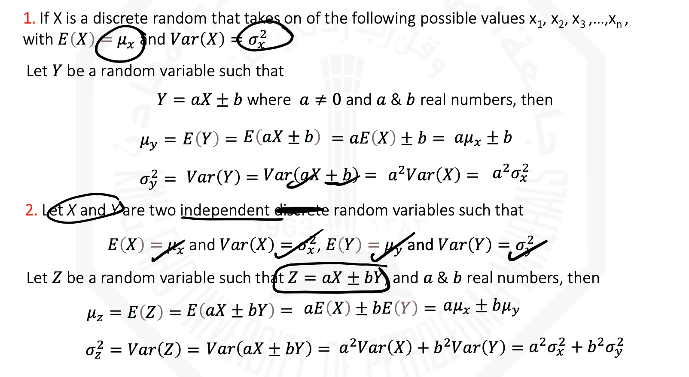

# Chapter 3: Discrete Random Variables & Probability Distributions

## Table of Contents

- [Chapter 3: Discrete Random Variables \& Probability Distributions](#chapter-3-discrete-random-variables--probability-distributions)
  - [Table of Contents](#table-of-contents)
  - [Objectives](#objectives)
  - [3.1: Discrete Random Variable](#31-discrete-random-variable)
  - [3.2: Discrete Probability Distribution (Probability Mass Function (PMF or PMD))](#32-discrete-probability-distribution-probability-mass-function-pmf-or-pmd)
  - [3.3 Cumulative Distribution Function (CDF)](#33-cumulative-distribution-function-cdf)
  - [3.4 Measuring the Center \& Variation](#34-measuring-the-center--variation)
    - [Properties of Expected Value and Variance](#properties-of-expected-value-and-variance)
  - [3.6: The Binomial Probability Distribution](#36-the-binomial-probability-distribution)
  - [3.8 Hyper-geometric Distribution](#38-hyper-geometric-distribution)
  - [3.9 The Poisson Distribution](#39-the-poisson-distribution)

## Objectives

1. Determine probabilities from probability mass functions and the reverse.
2. Determine probabilities and probability mass functions from cumulative distribution functions and the reverse.
3. Calculate means and variances for discrete random variables.
4. Understand the assumptions for discrete probability distributions.
5. Select an appropriate discrete probability distribution to calculate probabilities.
6. Calculate probabilities, means and variances for discrete probability distributions.

---

## 3.1: Discrete Random Variable

**Random Variable**: a possible numerical value from a random experiment.
Usually, it is from the end of the alphabet.

There are two classes:

    1. **Discrete**: counting process
    2. **Continuous**: measurement

Examples of Discrete Random Variable: the number of times heads appear in a 2 time coin toss.

---

## 3.2: Discrete Probability Distribution (Probability Mass Function (PMF or PMD))

It is a function such that

    1. the values are mutually exclusive
    2. the values are collectively exhaustive
    3. $0 \leq P(X = x_i) \leq 1$ aka axiom 1
    4. $\sum_{all \ i} P(X = x_i) = 1$ aka axiom 2
    5. $f(x_i) = P(X = x_i)$

---

## 3.3 Cumulative Distribution Function (CDF)

$F(x) = P(X \leq t) = \sum_{x_i \leq t} f(x_i)$

It satisfies the following:

    1. $F(x) = P(X \leq x) = \sum_{x_i \leq x} f(x_i)$
    2. $0 \leq F(x) \leq 1$
    3. If $x \leq y$, then $F(x) \leq F(y)$ 

It is always a piecewise function.

---

## 3.4 Measuring the Center & Variation

1. Expected Value or Mean

$\mu_x = E(x) = \sum_{All \ i} x_i P(X = x_i)$

2. Variance

$\sigma_x^2 = Var(x) = E (X - \mu_x)^2 = \sum [x - \mu_x]^2 P(X = x_i)$
$= \sum_{All \ i} x_i^2 P(X = x_i) - [\mu_x]^2 = E(X^2) - E(X)^2 = E(X^2) - \mu^2$

3. Standard Deviation

$\sigma_x = \sqrt{Var(X)}$

### Properties of Expected Value and Variance

---

## 3.6: The Binomial Probability Distribution

If an experiment has the following characteristics, it follows a binomial distribution

1. Fixed number of trials (n)
2. trials are Independent of each other (with replacement)
3. each trial has only Two possible outcomes (success/ failure)
4. Same probability of a "success" is p, and prob of failure is 1-p.

Fixed - Independent - Two - Same = FITS!

PMF: Given $X:B(n, p)$, $P(X = x) = C^n_x p^x (1-p)^{n-x}, x = 0, 1, 2, \ldots n$

x -> number of successes / n -> number of trials / p -> prob of success of 1 trial

Mean: $E(X) = np$
Variance: $Var(X) = np(1-p)$
Standard Deviation = $\sqrt{Var(X)}$

The shape depends on value of p:
p = 0.5 -> symmetric
p > 0.5 -> left-skewed
p < 0.5 -> right-skewed

---

## 3.8 Hyper-geometric Distribution

It is applicable when selecting from a finite population without replacement.

- n trials in a sample from a finite population f size N
- Sample taken without replacement
- Outcomes of trials are dependent
- Concerned with finding prob of x successes in the sample from X successes in the population

Formula: $P(x) = \frac{C^{N-X}_{n-x} C^{X}_{x}}{C^{N}_{n}}$

N = population size
X = num of items of interest in population
N-X = num of events not of interest
n = sample size
x = number of items of interest in the sample
n-x = number of events not of interest in the sample

Mean: $\frac{nX}{N}$
Variance: $\frac{nX}{N} (1- \frac{nX}{N})(\frac{N-n}{N-1})$

Binomial -> infinite without replacement OR finite with replacement
Hyper-geometric -> finite without replacement

## 3.9 The Poisson Distribution

Number of times an event occurs in a given area of opportunity

An **area of opportunity** is a continuous unit or interval of time or volume.

We use it when:

1. Individual events happen at random and independently
2. We know average per unit area (lambda) $\lambda$

Formula: $P(x) = \frac{(\lambda t)^x e^{-\lambda t}}{x!}, x = 0, 1, 2, \ldots$

x = number of events in segments of space
t = size of segment of interest (num of segments)
lambda = expected num of events per segments
e = base of natural log

Mean: $\lambda t$
Variance: $\lambda t$
Standard Deviation: $\sqrt{\lambda t}$

Shape depends on value of $\lambda t$, but it is always right-skewed.
