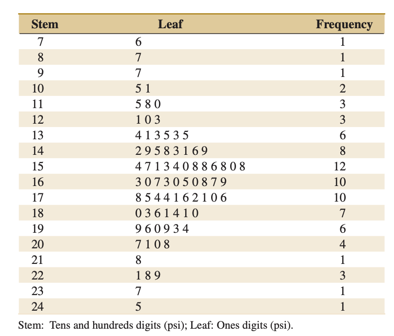
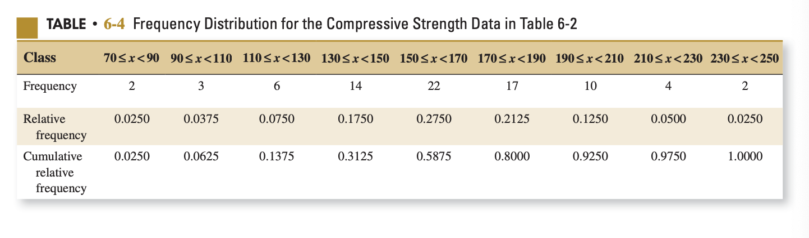
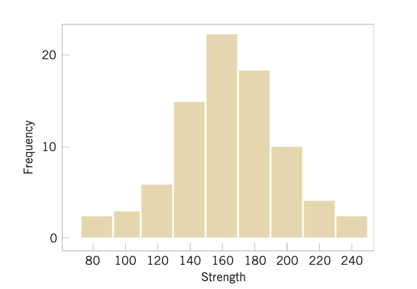

# Chapter 6: Descriptive Statistics

## Table of Contents

- [Chapter 6: Descriptive Statistics](#chapter-6-descriptive-statistics)
  - [Table of Contents](#table-of-contents)
    - [Introduction \& Terminology](#introduction--terminology)
      - [Data Types](#data-types)
      - [Objectives](#objectives)
    - [6.1: Numerical Summaries of Data](#61-numerical-summaries-of-data)
      - [Percentiles \& Quartiles](#percentiles--quartiles)
    - [6.2: Stem-and-Leaf Diagrams](#62-stem-and-leaf-diagrams)
    - [6.3: Frequency Distributions and Histograms](#63-frequency-distributions-and-histograms)
      - [Frequency Table](#frequency-table)
      - [Frequency Histogram](#frequency-histogram)
      - [Frequency Polygon](#frequency-polygon)
      - [Cumulative percentage polygon (Ogive)](#cumulative-percentage-polygon-ogive)
      - [Pareto Chart (Vital Few)](#pareto-chart-vital-few)
    - [6.4: Box Plots](#64-box-plots)

---

### Introduction & Terminology

- The field of statistics consists of two branches, or rather two stages: descriptive statistics and inferential statistics.
- Using data collected from a small group (aka a sample) to draw conclusions about a larger group (aka a population) is known as **inferential statistics**.
- The aspect of statistics that deals with data collection, organization, summarization, and analysis is called **descriptive statistics**.
- As we will see, there are both numeric and graphic techniques that efficiently summarize the data and help the statistician interpret the data and be ready for subsequent analysis.
- Any good statistical analysis of data should always begin with **plotting the data**.
- As hinted above, a population are all the individuals of interest, whereas the sample is a randomly selected part of the population for analysis.
- A summary measure that describes a population characteristic is a **parameter**, whereas one that describes a sample is a **statistic**.
- As a simple example, assume two people wanted to find the number of first honor students in KFUPM.
  - Person A asked all the students in the university (population) about their honor status and came up with a conclusion that 20% of the students are first honor. This measure is a parameter.
  - Person B asked 30 random (we will discuss later how to measure randomness) students and determined that around 5 of those 30 are first honors. This number he found is a statistic that he can use to *estimate* the population parameter.
- To describe any data we usually study 3 features:
  - central tendency (center position in data set, like average)
  - variation (amount of spread in the values, like standard deviation)
  - shape (pattern of distribution of values from lowest to highest)
- In examples, usually assume you are dealing with a sample unless stated otherwise.

#### Data Types

- Data are divided into numeric and categorical.
- Numerical data are further divided into discrete and continuous. Discrete data are countable, e.g., the number of first honor students. Continuous data usually need a measuring tool, like time or weight.
- Categorical data are either nominal or ordinal. Nominal ones have no natural order (blood type, eye color, ...etc.), while ordinal ones have a natural order (freshman, sophomore, junior, senior).

#### Objectives

1. Compute and interpret the sample mean, sample variance, sample standard deviation, sample median, and sample range.
2. Explain the concepts of sample mean, sample variance, population mean, and population variance.
3. Construct and interpret visual data displays, including the stem-and-leaf display, the histogram, and the box plot.
4. Explain the concept of random sampling.
5. Construct and interpret normal probability plots.
6. Explain how to use box plots and other data displays to visually compare two or more samples of data.
7. Know how to use simple time series plots to visually display the important features of time-oriented data.
8. Know how to construct and interpret scatter diagrams of two or more variables.

### 6.1: Numerical Summaries of Data

- To describe quantitative data, we can use the following measures:
  - Measures of central tendency (mean, median, and mode)
    - Mean
      - most common
      - $\mu$ for population, $\bar{x}$ for sample
      - comprehensive
      - heavily affected by outliers
      - $$ \bar{x} = \frac{\sum_{i=1}^n x_i}{n} = \frac{x_1 + x_2 + \ldots + x_n}{n}$$
      - **The sum of deviation from the mean is ZERO**
    - Median
      - $$ M_d = \begin{cases} x_{\left (\frac{n+1}{2} \right)} & \text{if } n \text{ is odd}, \\ \frac{1}{2} (x_{\left (\frac{n}{2} \right)} + \text{next}) & \text{if } n \text{ is even}\end{cases} $$
      - Easy to calculate
      - Does not use all info from data
      - Not affected by outliers
    - Mode
      - Is a measure for numeric or categorical data
      - The value(s) occurring the max number of times
      - Not affected by outliers
      - There may be no mode (if all are same)
      - There may be several modes.
  - Measures of variation (range, variation, IQR, and standard deviation)
  - Measures of shape (skewness)
    - Symmetric
      - Spread uniformly
      - Mean = Median = Mode
    - Left-Skewed
      - Mean < Median
    - Right-Skewed
      - Mean > Median

#### Percentiles & Quartiles

- If we talk about percentile $P_x$, we mean that $x$% of the data lie before and $100-x$% lie after.
- If you scored in a test in the $95^\text{th}$ percentile, then you are among the top 5 % scorers.
- The formulas to calculate the place (rank) of any percentile is found in the formula sheet of this course.
- The minimum & max are not considered percentiles although R software considers them. In statistics, we have from $1^\text{st}$ to $99^\text{th}$ percentiles.
- We might use interpolate to find the exact location.

- They split the data into 4 segments with an equal number of values between.
- $Q_1$ is the first quartile, where 25% of data lies before.
- $Q_2$ is the second quartile, where 50% of data lies before.
- $Q_3$ is the third quartile, where 75% of data lies before.

### 6.2: Stem-and-Leaf Diagrams

- useful in organizing **numerical** data **graphically**.
- Suited for data set points with at least 2 digits.
- Steps of drawing one:
  1. Divide each number into two parts: a **stem**, consisting of one or more of the leading digits, and a **leaf**, consisting of the remaining digit.
  2. List the stem values in a vertical column.
  3. Record the leaf for each observation beside its stem.
  4. Write the units for stems and leaves on the display.
- It is usually good to have between 5 to 20 stems.
- They are 3 in 1: a graph (easily changed to bar chart), a table (could be changed to frequency table), and provide exact data values.
- Some stem-and-leaf plots have an extra column called frequency, where for each stem, the number of leaves is mentioned.
- We need a legend that explains the graph to know what to stems refer to (tens, hundreds, or other meanings)
- Sometimes you need to divide the stems into two or more groups to make a graph that visually describes the data better.
- If the leaves are ordered from lowest to highest in every stem, then it is an **ordered stem-and-leaf diagram**.

Below is an example from the book:

### 6.3: Frequency Distributions and Histograms

- used for organizing **numerical data numerically**
- used for both continuous and discrete
- Data is gathered into **bins**, each defined by **class intervals**.

#### Frequency Table

- Steps:
    1. Sort if possible
    2. Find range $(R \approx max - min)$
    3. Find number of classes $(\lceil k \approx \sqrt{n} \rceil)$, where $n$ is num of observations.
    4. Find the width of a class interval $(\lceil C.W \approx \frac{R}{k} \rceil)$

- Notes:
  - must be mutually exclusive (Each value is in only ONE class.)
  - must be inclusive (all data values are represented)
  - different boundaries may provide different pictures for same data
  - When comparing two or more groups with different sample sizes, you must use either a relative frequency or a percentage distribution.

- If it is not clear, point number 4 basically means that it does not make any sense if I am comparing between two samples, where one has 100 and the other has 10 values, and I say that both have 2 values in a certain class. Obviously, 2/100 is NOT equivalent to 2/10. Hence, the use of relative frequency or percentage.
- A classic freq table consists of the classes column and the frequency column. This does not mean that other columns, like midpoints or cumulative frequency, could be added.

#### Frequency Histogram

- Vertical bar chart of the data in a frequency distribution
- There are no gaps between the bars.
- The class boundaries or midpoints are shown on the horizontal axis.
- Vertical axis is either frequency, relative frequency, or percentage.
- We can know the approximate *center* of the data, indicate the degree of *variation*, and have an idea about the *shape*.
- Steps:
  1. Construct a grouped frequency distribution.
  2. Draw the axes.
  3. Put the end points pf each class on the x-axis and the frequencies on the y-axis.
  4. Draw bars (without gaps) between each two endpoints.

- The example below has the midpoints shown with 9 bins. It is actually the representation of the table above.

#### Frequency Polygon

- We use midpoints and then connect the midpoints at their respective class percentages.
- The polygon needs to be closed to have an area of 1.

#### Cumulative percentage polygon (Ogive)

- Displays the variable of interest versus the cumulative percentages.
- Useful when there are 2 or more groups to compare

#### Pareto Chart (Vital Few)

- Rearrange the data in descending order and display both bar graphs and line graph.
- We can know which groups accumulate or represent the largest portion of the data.

> **All the previous graphs are used to organize numeric data.**

### 6.4: Box Plots

- A Five-Number summary: minimum, first quartile, median, third quartile, and the max
- Can be used to detect outliers
- Detects Skewness
  - total length
  - whisker length
  - the box only
- If the data values are between the inner & outer fences, they are **mild outliers** (1.5). If they are outside, they are **extreme outliers** (3).
- The interquartile range (IQR) is the difference between the third and first quartile (length of the box).