# Chapter 8: Statistical Interval for Single Sample

## Table of Contents

- [Chapter 8: Statistical Interval for Single Sample](#chapter-8-statistical-interval-for-single-sample)
  - [Table of Contents](#table-of-contents)
  - [Objectives](#objectives)
  - [8.1: Point and Interval Estimates](#81-point-and-interval-estimates)
    - [Student-T Distribution](#student-t-distribution)
    - [Confidence Interval](#confidence-interval)
    - [Determining the required sample size](#determining-the-required-sample-size)
  - [Summary](#summary)

## Objectives

- Distinguish between a point estimate and a confidence interval estimate.
- Construct and interpret a confidence interval estimate for a single population mean.
- Form and interpret a confidence interval estimate for a single population proportion.
- Determine the required sample size to estimate a single population parameter within a specified margin of error.

## 8.1: Point and Interval Estimates

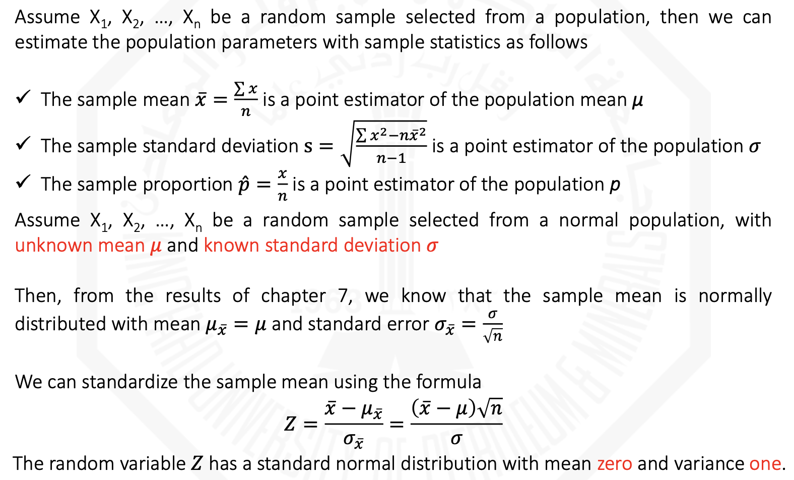

### Student-T Distribution

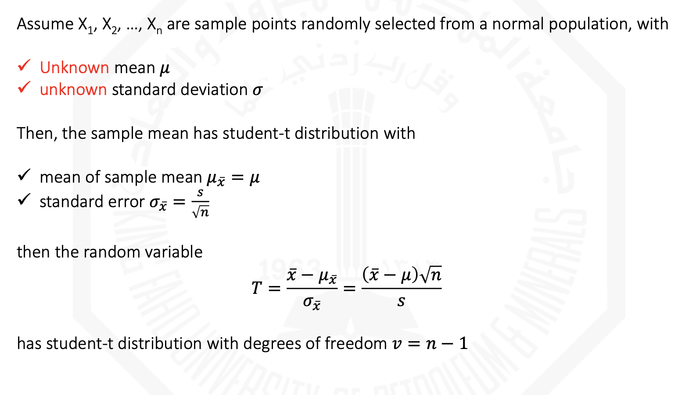

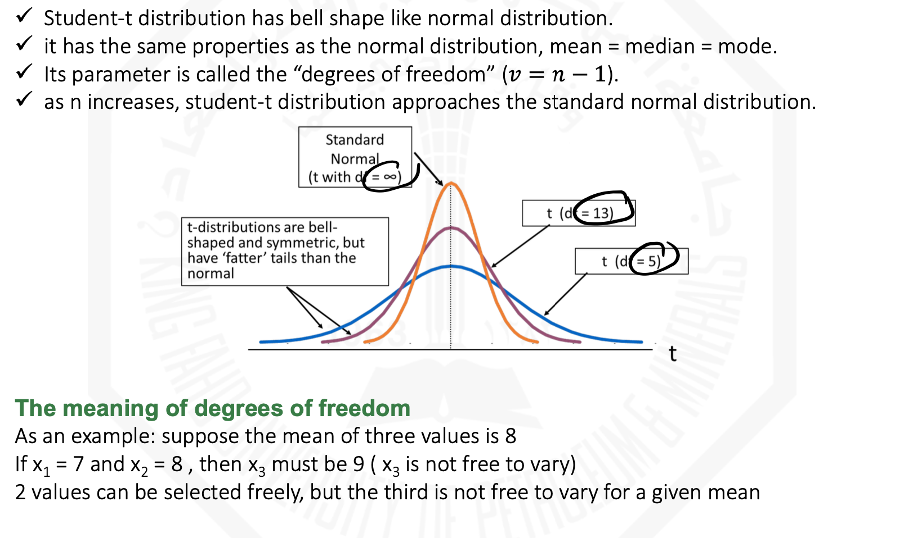

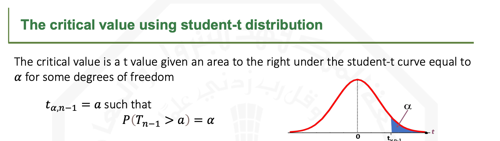

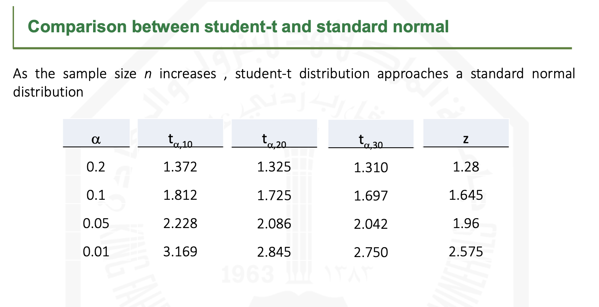

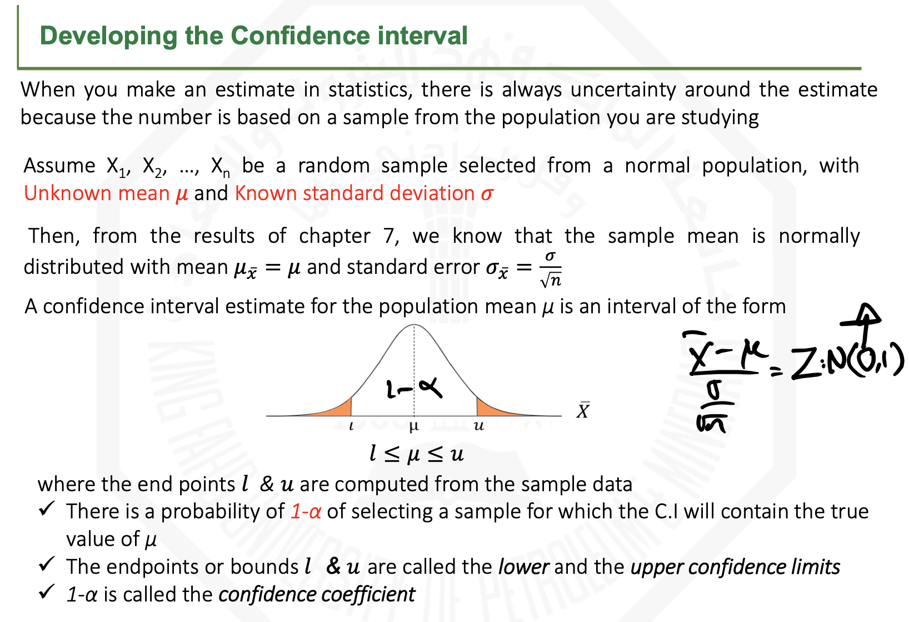

### Confidence Interval

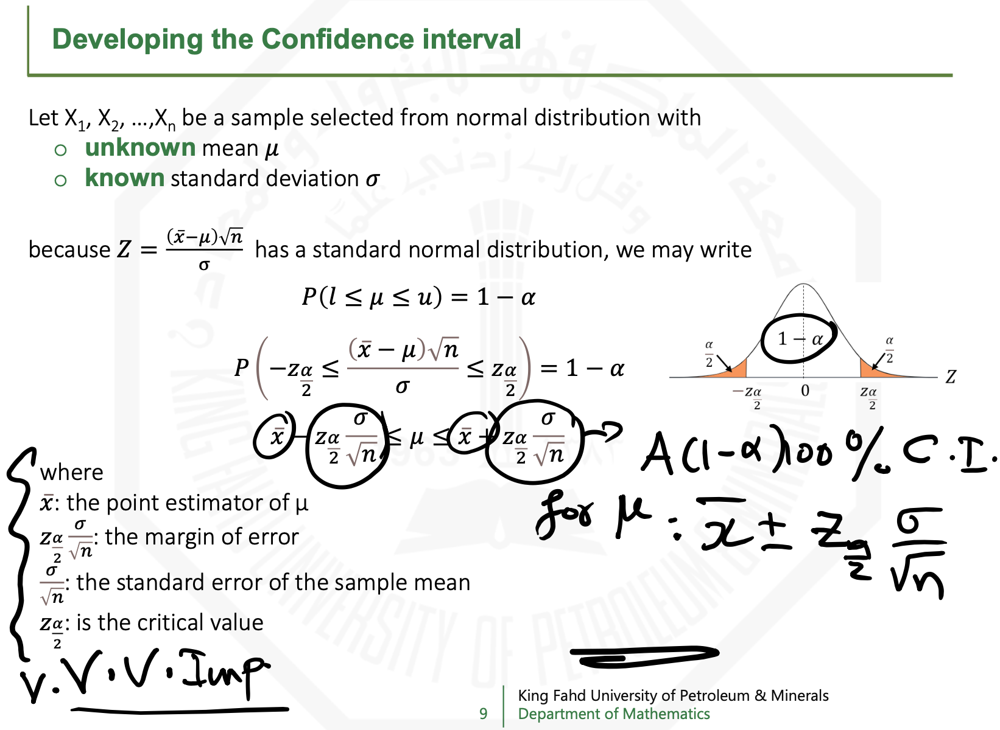

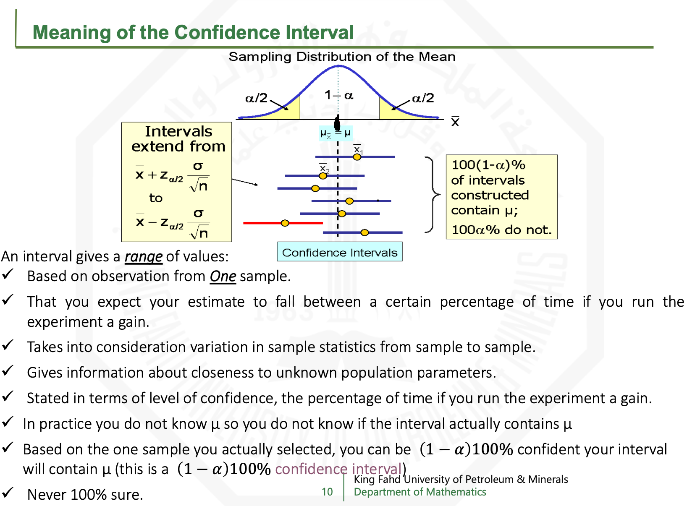

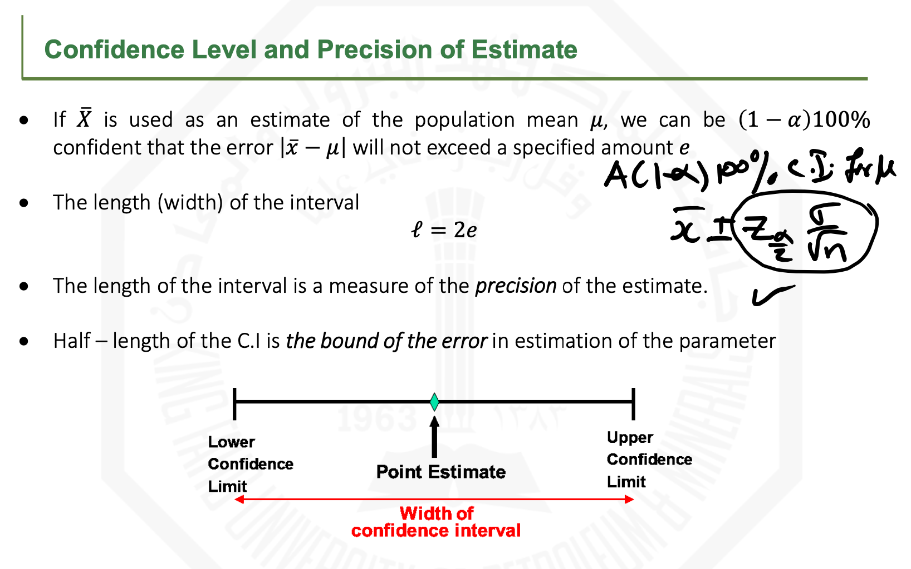

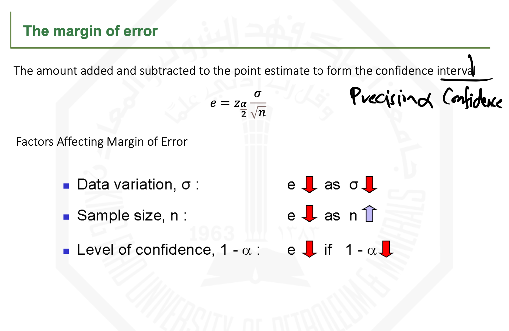

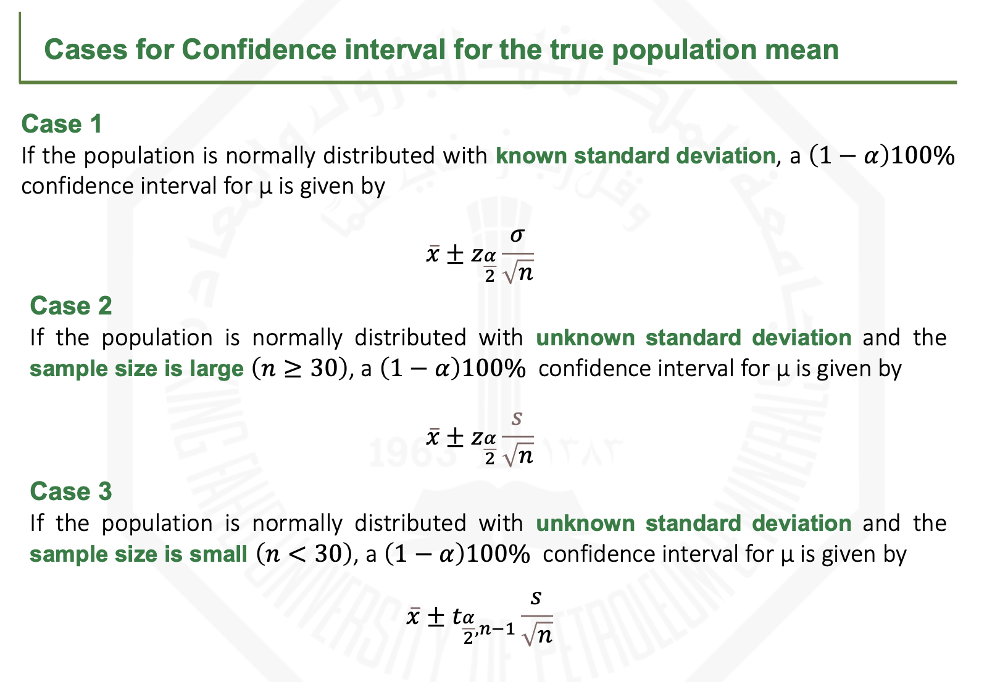

If the population distrubution's mean is UNKNOWN and sample size is small, then we MUST assume that the population is NORMAL.

### Determining the required sample size

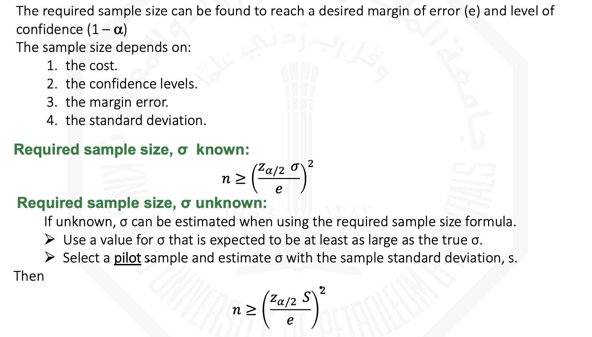

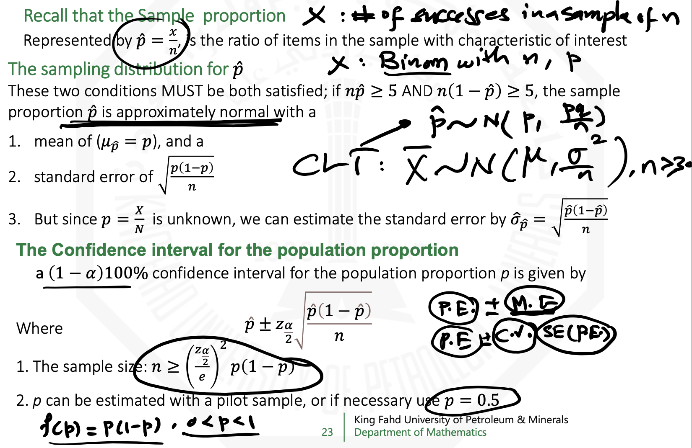

## Summary

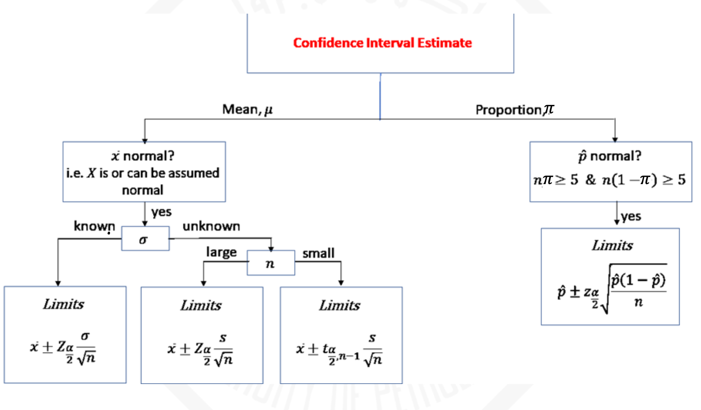