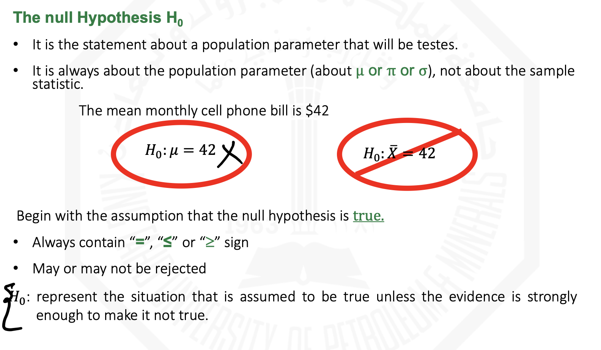
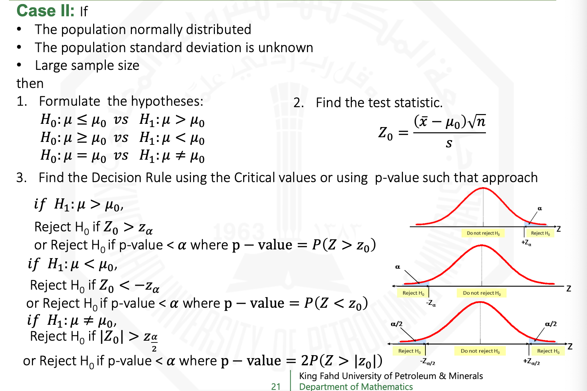
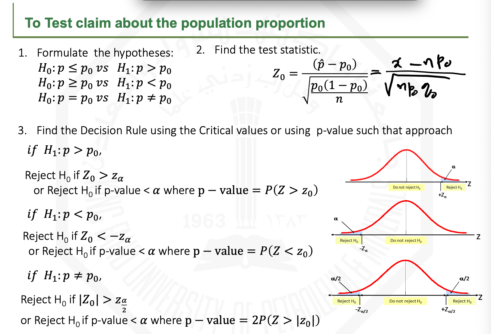

# Chapter 9: Hypothesis Testing of a Single Sample

## Table of Contents

- [Chapter 9: Hypothesis Testing of a Single Sample](#chapter-9-hypothesis-testing-of-a-single-sample)
  - [Table of Contents](#table-of-contents)
  - [Objectives](#objectives)
  - [9.1: Hypothesis-Testing Methodology](#91-hypothesis-testing-methodology)
    - [Two Types of Hypotheses](#two-types-of-hypotheses)
    - [Types of Errors](#types-of-errors)
      - [Calculating them](#calculating-them)
    - [P-value](#p-value)
      - [Finding p-value](#finding-p-value)
    - [Hypothesis Testing Process (VIP)](#hypothesis-testing-process-vip)
  - [9.2 \& 9.3: Cases on testing the mean of a normal population](#92--93-cases-on-testing-the-mean-of-a-normal-population)
  - [9.5: Testing for the Population Proportion](#95-testing-for-the-population-proportion)

## Objectives

1. The basic principles of hypothesis testing.
2. Structure engineering decision – making problem as hypothesis tests.
3. How to use hypothesis testing to test a mean or to test proportion.
4. Explain and use the relationship between confidence interval and hypothesis test.

## 9.1: Hypothesis-Testing Methodology

### Two Types of Hypotheses

### Types of Errors

#### Calculating them

### P-value

#### Finding p-value

### Hypothesis Testing Process (VIP)

## 9.2 & 9.3: Cases on testing the mean of a normal population

## 9.5: Testing for the Population Proportion

